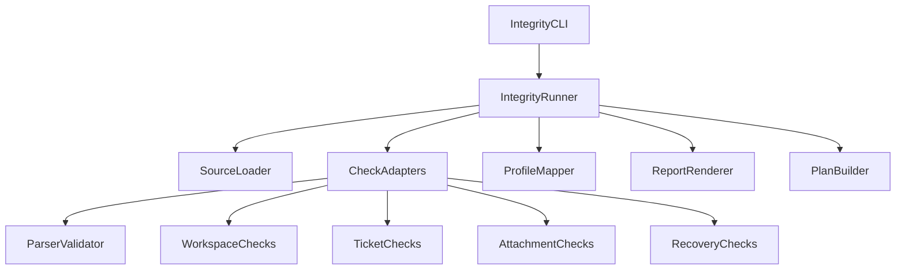
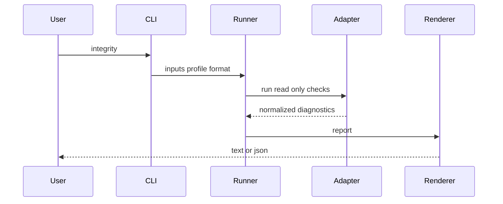
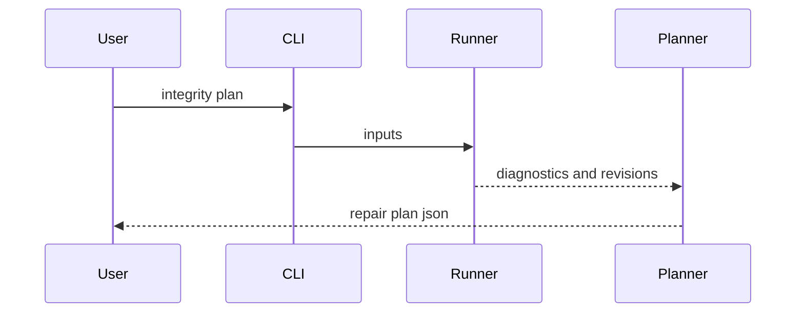

# Design Document

## Overview

**Purpose**: Provide a staged integrity suite for lifetxt data, beginning with a read-only aggregate report and expanding through explicit repair planning, cross-file registry checks, import/sync reconciliation, recovery diagnosis, and opt-in strict profiles.

**Users**: lifetxt users, AI-assisted workflows, release operators, and maintainers use this suite to decide whether authoritative data is safe to read, mutate, sync, archive, or expose to automation.

**Impact**: Adds new integrity-oriented CLI surfaces while preserving existing specialized commands and the permissive parser contract.

### Goals

- Provide one read-only entry point for high-value consistency checks.
- Reuse existing validation, workspace, ticket, attachment, and recovery logic.
- Produce stable text and JSON reports suitable for humans, scripts, and future MCP exposure.
- Separate diagnosis, repair planning, and repair application.
- Preserve normal permissive parsing while allowing opt-in stricter profiles.

### Non-Goals

- No silent automatic repair.
- No background sync or external-service access.
- No parser rejection of unknown custom keys.
- No data deletion, migration, restore, archive cleanup, or transaction recovery action.
- No replacement of existing `check`, `ids`, `workspace`, `ticket`, or recovery commands.

## Boundary Commitments

### This Spec Owns

- The user-visible `lifetxt integrity` family concept.
- A normalized integrity report contract for text and JSON output.
- Repair-plan shape for later proposal-first or revision-checked application.
- Cross-file ID/reference audit behavior.
- Source/UID reconciliation audit behavior for local records.
- Recovery and transaction integrity diagnosis as read-only checks.
- Strict profile behavior for integrity reporting.

### Out of Boundary

- Direct mutation by `integrity` in the first read-only slice.
- `integrity apply` implementation until a separate Ready issue defines approval, rollback, and traceability.
- Any external network sync.
- Any change to the core parser's unknown-key permissiveness.
- Server deployment update behavior, except that server-update may later call the integrity command as one configured check.

### Allowed Dependencies

- `lifetxt.parser.parse_text` and existing diagnostic structures.
- `lifetxt.validator.validate_item`.
- `lifetxt.ids` duplicate and assignment helpers.
- Existing link, dependency, workspace, ticket, attachment, and recovery modules.
- `lifetxt.write_operations.current_revision` for read-only revision capture.
- Existing CLI formatting and JSON conventions.

### Revalidation Triggers

- Diagnostic envelope or severity changes.
- Changes to ID key configuration semantics.
- Changes to workspace source role or write-target resolution.
- Changes to transaction journal or integrity-manifest formats.
- Changes to import/sync generated-record metadata semantics.

## Architecture

### Existing Architecture Analysis

lifetxt already has several specialized integrity checks. The design adds a thin orchestration layer that invokes existing read-only checks, normalizes diagnostics, and optionally applies profile severity mapping. Repair planning consumes the normalized diagnostics but remains non-mutating.

### Architecture Pattern & Boundary Map



**Architecture Integration**

- Selected pattern: adapter-based aggregation over existing read-only checks.
- Dependency direction: CLI -> runner -> adapters -> existing domain modules -> report or plan renderers.
- Existing patterns preserved: no new parser, no new write path, no direct file mutation.
- New components rationale: a normalized integrity result is needed because existing checks report in command-specific formats.

## File Structure Plan

### Modified Files

- `lifetxt/cli.py` - register `integrity` subcommands and route arguments to the runner.
- `docs/en/cli.md` and `docs/ja/cli.md` - document command usage, profiles, and non-mutating guarantees.
- `docs/en/timezone-revision-workspace-safety.md` and `docs/ja/timezone-revision-workspace-safety.md` - cross-link integrity workflows where workspace/revision safety is discussed.
- `.ai/project/CAPABILITIES.yml` and `.ai/project/TRACEABILITY.yml` - record implemented slices as they land.

### New Files

- `lifetxt/integrity.py` - normalized report types, runner, profile mapping, and check orchestration.
- `lifetxt/integrity_plan.py` - non-mutating repair plan model and builder.
- `tests/test_integrity.py` - focused unit and CLI behavior tests.

## System Flows

### Read-only report



### Repair planning



## Requirements Traceability

| Requirement | Summary | Components | Interfaces | Flows |
| --- | --- | --- | --- | --- |
| 1.1 | Aggregate applicable checks | IntegrityRunner, CheckAdapters | CLI, Report | Read-only report |
| 1.2 | JSON report envelope | ReportRenderer | JSON report | Read-only report |
| 1.3 | Skipped or blocked checks | IntegrityRunner | Diagnostic envelope | Read-only report |
| 1.4 | No writes | IntegrityCLI, CheckAdapters | Read-only contract | Read-only report |
| 2.1 | Deterministic repair plan | PlanBuilder | JSON plan | Repair planning |
| 2.2 | Manual repair classification | PlanBuilder | Plan item | Repair planning |
| 2.3 | Expected revisions | PlanBuilder | Plan target | Repair planning |
| 2.4 | Plan suitable for later review | PlanBuilder | JSON plan | Repair planning |
| 3.1 | Cross-file duplicate IDs | CrossFileRegistryAdapter | Diagnostic envelope | Read-only report |
| 3.2 | Broken or ambiguous references | CrossFileRegistryAdapter | Diagnostic envelope | Read-only report |
| 3.3 | Source role distinction | WorkspaceAdapter | Diagnostic envelope | Read-only report |
| 3.4 | Archive/generated roles | WorkspaceAdapter | Diagnostic envelope | Read-only report |
| 4.1 | Source UID duplicates | SyncReconciliationAdapter | Diagnostic envelope | Read-only report |
| 4.2 | Manual/generated conflicts | SyncReconciliationAdapter | Diagnostic envelope | Read-only report |
| 4.3 | Stale generated records | SyncReconciliationAdapter | Diagnostic envelope | Read-only report |
| 4.4 | No network access | SyncReconciliationAdapter | Read-only contract | Read-only report |
| 5.1 | Manifest and revision status | RecoveryAdapter | Diagnostic envelope | Read-only report |
| 5.2 | Blocked recovery evidence | RecoveryAdapter | Diagnostic envelope | Read-only report |
| 5.3 | Healthy recovery status | RecoveryAdapter | Diagnostic envelope | Read-only report |
| 5.4 | No recovery action | RecoveryAdapter | Read-only contract | Read-only report |
| 6.1 | Default permissive behavior | ProfileMapper | Profile contract | Read-only report |
| 6.2 | Strict severity escalation | ProfileMapper | Profile contract | Read-only report |
| 6.3 | Original and effective severity | ReportRenderer | JSON report | Read-only report |
| 6.4 | No `check` behavior change | IntegrityCLI | CLI boundary | Read-only report |
| 7.1 | Ready issue per slice | Implementation governance | Tasks | Implementation |
| 7.2 | Docs and traceability | Implementation governance | PR evidence | Implementation |
| 7.3 | Change package where required | Implementation governance | Change package | Implementation |

## Components and Interfaces

| Component | Domain | Intent | Req Coverage | Key Dependencies | Contracts |
| --- | --- | --- | --- | --- | --- |
| IntegrityCLI | CLI | Parse integrity commands and enforce no-write defaults | 1.1, 1.4, 6.4 | argparse P0 | CLI |
| IntegrityRunner | Service | Coordinate check adapters and profile mapping | 1.1, 1.3, 6.1, 6.2 | adapters P0 | Service |
| CheckAdapters | Service | Wrap existing checks into normalized diagnostics | 1.1, 3.1, 4.1, 5.1 | existing modules P0 | Service |
| ProfileMapper | Service | Convert base severity to effective severity | 6.1, 6.2, 6.3 | profile config P1 | Service |
| ReportRenderer | CLI | Emit text or JSON reports | 1.2, 6.3 | diagnostic model P0 | CLI, JSON |
| PlanBuilder | Service | Produce non-mutating repair plans | 2.1, 2.2, 2.3, 2.4 | diagnostics P0 | JSON |

### IntegrityRunner

| Field | Detail |
| --- | --- |
| Intent | Aggregate read-only integrity checks into one normalized result |
| Requirements | 1.1, 1.3, 1.4, 6.1, 6.2 |

**Responsibilities & Constraints**

- Loads source context once and passes it to check adapters.
- Runs only read-only adapters.
- Preserves skipped and blocked check states.
- Applies profile mapping after base diagnostics are produced.

**Contracts**: Service [x] / API [ ] / Event [ ] / Batch [ ] / State [ ]

##### Service Interface

```python
def run_integrity(inputs, *, workspace=None, profile="default", verify_files=False):
    """Return an IntegrityReport without mutating any source or evidence file."""
```

### Diagnostic Envelope

```python
{
    "code": "W213",
    "severity": "warning",
    "effective_severity": "warning",
    "category": "ids",
    "message": "...",
    "hint": "...",
    "source_file": "...",
    "line": 12,
    "item_id": "task_1",
    "check_state": "reported"
}
```

Allowed `check_state` values: `reported`, `passed`, `skipped`, `blocked`.

### Repair Plan

```python
{
    "version": 1,
    "created_from": {"command": "lifetxt integrity plan"},
    "targets": [{"path": "life.txt", "expected_revision": "..."}],
    "items": [
        {
            "diagnostic_code": "W213",
            "action": "manual",
            "reason": "duplicate id requires user choice"
        }
    ]
}
```

The plan is descriptive until a separate issue implements revision-checked application.

## Error Handling

- Invalid CLI usage returns existing argparse behavior.
- Missing files are diagnostics, not unhandled exceptions, when the integrity report can continue.
- Unsupported recovery evidence is `blocked`, not guessed.
- Strict profile escalation never hides the original base severity.

## Testing Strategy

- Unit tests: normalized report shape, profile mapping, skipped/blocked check handling, no-write guarantee.
- Integration tests: `lifetxt integrity` over fixtures covering duplicate IDs, dangling links, file hash mismatch, workspace ambiguity, ticket history gap, source-UID duplicates, and recovery evidence states.
- CLI tests: text and JSON output, strict profile severity escalation, missing context reporting.
- Regression tests: existing `check`, `workspace validate`, and ticket validation behavior remains unchanged.

## Security Considerations

- The suite must not reveal secrets in config, diagnostics, support bundles, paths that existing redaction policy would hide, or external sync credentials.
- The sync reconciliation audit is local-only and must not contact network services.

## Performance & Scalability

- The first read-only slice should parse each selected source at most once.
- Directory hash verification remains opt-in because it can be expensive on large trees.

## Migration Strategy

No data migration is part of this spec. Any later repair-application feature must be its own Ready issue with explicit revision, approval, rollback, and traceability rules.
