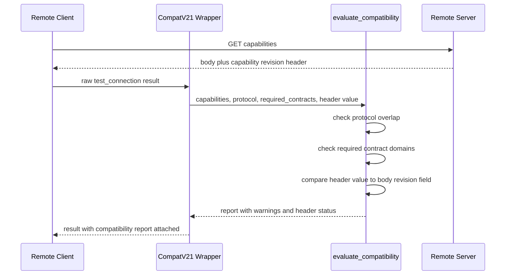

# Design Document

> **Authoritative copy lives in the change package, not here.** This change is Standard assurance
> and S-sized (GitHub Issue #120), below the `.ai/project/changes/README.md` threshold — the issue
> and its pull request carry the authoritative record; this file is the working spec.

## Overview

**Purpose**: This feature gives Remote client operators explicit, actionable warnings — instead of silence — when a contract domain their client depends on is missing or under-versioned on the server, and when a reverse proxy or cache has stripped or rewritten the capability-revision negotiation header.

**Users**: Operators running `lifetxt remote test PROFILE`, and any code calling `evaluate_compatibility()` directly (dependency-free Remote CLI/TUI clients), will see the new warnings in the existing compatibility report.

**Impact**: Extends `evaluate_compatibility()` in `lifetxt/remote_compatibility_v21.py` with two new optional, purely-additive inputs. No existing caller's output changes unless it opts in.

### Goals
- Surface a warning when a caller-specified contract domain is absent or below its expected version.
- Surface a warning, with a distinguishing status, when the capability-revision header is missing or disagrees with the response body.
- Keep every existing caller's output byte-identical when the new parameters are not supplied.

### Non-Goals
- Changing what the server publishes in `contracts` or `capability_revision`.
- Bumping `REMOTE_PROTOCOL_CURRENT` or otherwise changing the wire protocol.
- Server-side enforcement or rejection based on `required_contracts`.
- Any transport, pagination, or streaming behavior (separate spec in the same `feature/dev-remote` batch).
- Any change to authorization, session, or role/scope logic.

## Boundary Commitments

### This Spec Owns
- The `required_contracts` parameter and per-domain warning logic added to `evaluate_compatibility()`.
- The `capability_revision_header` parameter and `header_status` field added to `evaluate_compatibility()`.
- Documentation of both additions in `docs/en/remote-compatibility.md` and `docs/ja/remote-compatibility.md`.
- The `cap-remote-compatibility-negotiation` capability registry entry and its traceability chain.

### Out of Boundary
- The shape and content of the `contracts` map itself (`compatibility_manifest()` / `_CONTRACT_PATTERNS`) — read, not modified.
- The Remote wire protocol version and `compatibility_policy()` — unchanged.
- `lifetxt/remote_access.py` authorization, session, and role/scope logic — untouched.
- `lifetxt/remote_client.py` — discovery (see `research.md`) found the header/body comparison fits entirely inside the existing `install_remote_client_compatibility_v21()` wrapper in `remote_compatibility_v21.py`, so this file is not modified by this spec.
- Transport, pagination, caching, and streaming contracts — tracked as a separate spec in this batch.

### Allowed Dependencies
- `compatibility_manifest()`'s published `contracts` map shape (domain name → `available`/`minimum`/`current`/`schemas`).
- `remote_access.REMOTE_CAPABILITY_REVISION_HEADER` and the fact that the header value and the body's `capability_revision` field are set from the same computed value (`research.md`, Extension Point Analysis).
- The existing `evaluate_compatibility()` return shape (`ok`, `status`, `requested_protocol`, `client`, `server`, `overlap`, `selected_protocol`, `manifest_present`, `warnings`).

### Revalidation Triggers
- `_CONTRACT_PATTERNS` domain names or the `contracts` map shape changes.
- The server stops embedding `capability_revision` in the JSON body, or starts computing the header value from a different source than the body field.
- `evaluate_compatibility()`'s or `test_connection()`'s return shape changes.

## Architecture

### Existing Architecture Analysis
`remote_compatibility_v21.py` installs two monkeypatches: `install_remote_compatibility_v21()` wraps `remote_access._capability_v2` to add `compatibility_manifest()`'s fields (`server`, `schema_bundle`, `contracts`, `optional_dependencies`, `compatibility`) to the server's capability response and recompute `capability_revision` over the extended payload. `install_remote_client_compatibility_v21()` wraps `remote_client.test_connection` to add a `compatibility` key computed by `evaluate_compatibility(result.get("capabilities"), result.get("requested_protocol"))`. `evaluate_compatibility()` itself is a pure function: it compares client/server protocol ranges and returns overlap, selection, and warnings; it never inspects `contracts`, and neither wrapper compares the capability-revision header against the body today.

### Architecture Integration
- **Selected pattern**: Extend the existing pure evaluator function in place (see `research.md`, Architecture Pattern Evaluation) rather than adding a new function or module.
- **Domain/feature boundaries**: All new logic lives inside `evaluate_compatibility()`; the calling wrapper (`install_remote_client_compatibility_v21`) changes only its call site to pass one additional keyword argument.
- **Existing patterns preserved**: `evaluate_compatibility()` remains a pure function with no I/O; the monkeypatch-installation pattern used by both `install_*_v21` functions is unchanged.
- **New components rationale**: No new components. Two new optional parameters and their associated `warnings`/`header_status` output on the existing function satisfy every acceptance criterion.
- **Steering compliance**: Matches `RULES.md`'s "keep remote access... proposal-producing" posture — every new signal is advisory/reporting, not enforcement.

### Technology Stack

| Layer | Choice / Version | Role in Feature | Notes |
|-------|------------------|------------------|-------|
| Backend / Services | Python (stdlib only) | `evaluate_compatibility()` extension | No new dependency; uses `collections.OrderedDict`, already imported |

## File Structure Plan

### Modified Files
- `lifetxt/remote_compatibility_v21.py` — add `required_contracts` and `capability_revision_header` parameters to `evaluate_compatibility()`; add domain-check and header-status logic; update the one call site inside `install_remote_client_compatibility_v21()` to pass `capability_revision_header=result.get("capability_revision")`.
- `tests/test_remote_compatibility_v21.py` — add cases listed in Testing Strategy.
- `docs/en/remote-compatibility.md` — document `required_contracts` and `header_status`.
- `docs/ja/remote-compatibility.md` — Japanese counterpart.
- `.ai/project/CAPABILITIES.yml` — new `cap-remote-compatibility-negotiation` entry.
- `.ai/project/TRACEABILITY.yml` — new chain row for `req-remote-compatibility-domain-awareness` / `cap-remote-compatibility-negotiation`, this issue, and its PR.

### Not Modified (confirmed during discovery)
- `lifetxt/remote_client.py` — see Boundary Commitments; `test_connection()` already returns everything the extended wrapper needs.
- `lifetxt/remote_access.py` — read for reference only.

## System Flows



Key decision not visible in the diagram: the header/body comparison happens inside `Eval`, not `Wrapper` — `Wrapper` only forwards the two values it already has, keeping the comparison logic in the one function that already owns compatibility warnings.

## Requirements Traceability

| Requirement | Summary | Components | Interfaces | Flows |
|-------------|---------|-------------|------------|-------|
| 1.1-1.5 | Domain-aware contract warnings | Remote Compatibility Evaluator | `evaluate_compatibility(required_contracts=...)` | Sequence diagram, "check required contract domains" |
| 2.1-2.2 | Backward-compatible defaults | Remote Compatibility Evaluator | `evaluate_compatibility()` default parameters | N/A |
| 3.1-3.4 | Capability-revision header integrity | Remote Compatibility Evaluator, CompatV21 Wrapper | `evaluate_compatibility(capability_revision_header=...)` | Sequence diagram, "compare header value to body revision field" |
| 4.1-4.2 | Documentation | `docs/en/remote-compatibility.md`, `docs/ja/remote-compatibility.md` | N/A | N/A |

## Components and Interfaces

| Component | Domain/Layer | Intent | Req Coverage | Key Dependencies (P0/P1) | Contracts |
|-----------|---------------|--------|---------------|----------------------------|-----------|
| Remote Compatibility Evaluator | `lifetxt.remote_compatibility_v21` | Compare client/server protocol, contract domains, and header integrity; return one report | 1.1-1.5, 2.1-2.2, 3.1-3.4 | `_CONTRACT_PATTERNS` (P0, existing) | Service |
| CompatV21 Client Wrapper | `lifetxt.remote_compatibility_v21` | Thread the fetched header value into the evaluator; unchanged otherwise | 3.1 | Remote Compatibility Evaluator (P0) | Service |

### Remote Compatibility Domain

#### Remote Compatibility Evaluator

| Field | Detail |
|-------|--------|
| Intent | Pure function producing the Remote compatibility report, now including optional domain and header-integrity checks |
| Requirements | 1.1, 1.2, 1.3, 1.4, 1.5, 2.1, 2.2, 3.1, 3.2, 3.3, 3.4 |

**Responsibilities & Constraints**
- Stays a pure function: no network I/O, no mutation of `capabilities`.
- Every new check is opt-in; the function's existing protocol-overlap behavior and return keys (`ok`, `status`, `requested_protocol`, `client`, `server`, `overlap`, `selected_protocol`, `manifest_present`) are unchanged in all cases.
- `warnings` is the only list that grows; both new checks append to it rather than introducing parallel warning lists.

**Dependencies**
- Inbound: CompatV21 Client Wrapper — supplies `capability_revision_header` (P0)
- Inbound: any direct caller (e.g. future dependency-free Remote clients) — supplies `required_contracts` (P1)
- Outbound: none (pure function)

**Contracts**: Service [x] / API [ ] / Event [ ] / Batch [ ] / State [ ]

##### Service Interface
```python
_UNSET = object()  # module-private sentinel

def evaluate_compatibility(
    capabilities: Mapping[str, Any],
    requested_protocol: Optional[int] = None,
    required_contracts: Optional[Union[Iterable[str], Mapping[str, Optional[int]]]] = None,
    capability_revision_header: Any = _UNSET,
) -> "OrderedDict[str, Any]":
    """Return the deterministic client/server compatibility report.

    New in this feature (both optional, both purely additive):
      required_contracts: contract-domain names (or a domain -> minimum-version
        mapping) the caller depends on. Unknown domain names raise ValueError
        naming the valid domains from _CONTRACT_PATTERNS. Each domain that is
        absent, unavailable, or below its required minimum version adds one
        warning naming that domain.
      capability_revision_header: the raw X-Lifetxt-Remote-Capability-Revision
        header value the transport layer received (None if the header was
        absent). Omit this parameter entirely to skip the check -- passing
        None explicitly means "the header was missing" and is NOT the same as
        omitting it. When supplied, the return value gains a
        "header_status" key: "present-and-consistent", "missing", or
        "mismatch", and a warning is added for the latter two.
    """
```
- Preconditions: `capabilities` is the dict from a `/api/remote/v1/capabilities` response, or `{}`. If `required_contracts` names a domain not present in `_CONTRACT_PATTERNS`, the call raises `ValueError` before evaluating anything.
- Postconditions: return dict contains all pre-existing keys unchanged; gains `header_status` only when `capability_revision_header` was supplied; `warnings` gains zero or more new entries from the two new checks, appended after the pre-existing protocol-overlap warnings.
- Invariants: `evaluate_compatibility(capabilities, requested_protocol)` (two positional args, as every current caller invokes it) returns byte-identical output to the pre-feature implementation.

**Implementation Notes**
- Integration: the sole call site to update is inside `install_remote_client_compatibility_v21()`.
- Validation: unit tests assert the two-argument call form is unchanged (regression) before asserting any new behavior.
- Risks: none beyond those in `research.md`.

#### CompatV21 Client Wrapper

| Field | Detail |
|-------|--------|
| Intent | Pass the already-fetched header value through to the evaluator; no new logic beyond one added keyword argument |
| Requirements | 3.1 |

**Responsibilities & Constraints**
- Continues to call `original(profile)` (the base `remote_client.test_connection`) unchanged, then attaches `result["compatibility"]`.
- Adds exactly one keyword argument to its existing `evaluate_compatibility(...)` call: `capability_revision_header=result.get("capability_revision")`.

**Dependencies**
- Outbound: Remote Compatibility Evaluator (P0)

**Contracts**: Service [x] / API [ ] / Event [ ] / Batch [ ] / State [ ]

**Implementation Notes**
- Integration: one-line change at `remote_compatibility_v21.py:287-291` (current line numbers).
- Validation: an installed-wrapper test using a stubbed `remote_client.test_connection` confirms the keyword argument is threaded through without a real network call.
- Risks: none.

## Error Handling

### Error Strategy
- Invalid `required_contracts` domain name: raise `ValueError` immediately (fail fast), naming the valid domains. This is a caller-code defect, not a runtime/network condition, so it is not represented as a warning.
- Missing or mismatched capability-revision header: represented as data (`header_status` plus a `warnings` entry), never an exception — a proxy issue is an operating condition the caller should be able to inspect and continue past, consistent with the existing "warnings, not errors" shape of `evaluate_compatibility()`.

### Monitoring
No new logging/metrics; the existing `lifetxt remote test` report is the operator-facing surface for this data, per `RULES.md`'s existing Remote diagnostics posture.

## Testing Strategy

### Unit Tests
- `evaluate_compatibility(capabilities, requested_protocol)` (two positional args) returns output identical to the current implementation, on the existing fixtures in `tests/test_remote_compatibility_v21.py` — regression guard for Requirement 2.
- `required_contracts=["ticket_workflow"]` against a manifest missing that domain produces exactly one new warning naming `ticket_workflow` — Requirement 1.2.
- `required_contracts={"ticket_workflow": 9}` against a manifest whose `ticket_workflow.current` is below 9 produces a warning naming the domain and the shortfall — Requirement 1.3.
- `required_contracts=["not_a_real_domain"]` raises `ValueError` naming the valid `_CONTRACT_PATTERNS` domains.
- `capability_revision_header` parameter omitted entirely — no `header_status` key in the result, output otherwise unchanged — Requirement 2 applied to Requirement 3.
- `capability_revision_header=None` with a `capabilities["capability_revision"]` present — `header_status == "missing"` plus one new warning — Requirement 3.2.
- `capability_revision_header` set to a value differing from `capabilities["capability_revision"]` — `header_status == "mismatch"` plus one new warning — Requirement 3.3.
- `capability_revision_header` equal to `capabilities["capability_revision"]` — `header_status == "present-and-consistent"`, no new warning — Requirement 3.4.

### Integration Tests
- `install_remote_client_compatibility_v21()` installed over a stubbed `remote_client.test_connection` (no real network) confirms `result["compatibility"]["header_status"]` reflects the stub's header/body values end-to-end — confirms the one-line wrapper change actually threads the value through.

## Security Considerations
No new authentication, authorization, or data-exposure surface: every input to the new checks (contracts map, capability-revision header/body) is already published today. `required_contracts` domain names are caller-supplied but only used as dict lookups and validated against a fixed allow-list (`_CONTRACT_PATTERNS`), so no injection surface is introduced.
