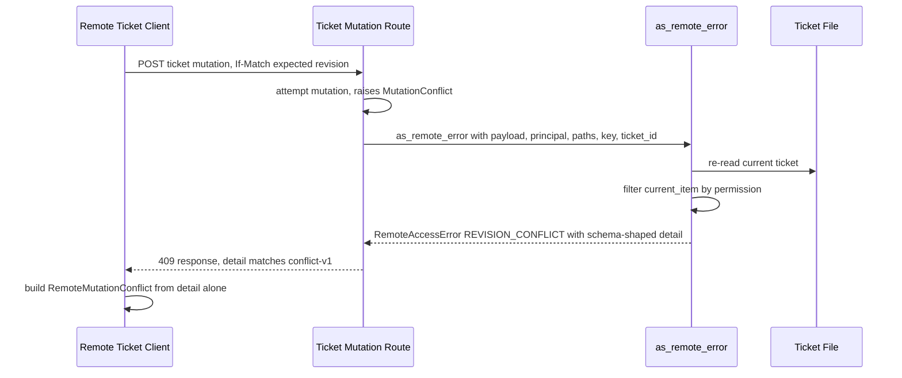

# Design Document

> **Authoritative copy lives in the change package, not here.** This change is Standard assurance
> and M-sized with a written split-justification (GitHub Issue #122), below the
> `.ai/project/changes/README.md` threshold — the issue and its pull request carry the
> authoritative record; this file is the working spec.

## Overview

**Purpose**: Give Remote client developers and operators the full, standard-shaped conflict data (`expected_revision`, `current_revision`, `attempted_change`, permission-filtered `current_item`) for a ticket-mutation conflict, from the failed request itself, instead of a partial ad hoc shape that forces an extra round trip to reconstruct.

**Users**: Any Remote ticket-write client (the dependency-free CLI/TUI client in `remote_client_writes.py`, and any future client reading the same wire contract) sees richer, schema-conformant conflict data with one fewer network call per conflict.

**Impact**: Changes the wire shape of the `detail` object inside a ticket-mutation `REVISION_CONFLICT` error response, and the corresponding client-side `RemoteMutationConflict` object. The outer Remote error envelope (`error: "REVISION_CONFLICT"`, HTTP 409) is unchanged.

### Goals
- The `detail` payload of a Remote ticket-mutation conflict validates against `dist/schemas/conflict-v1.schema.json`.
- `current_item` respects the same permission/visibility rules as an ordinary read.
- The client presents a conflict entirely from the failed request's response, with no extra network call.
- Existing "not auto-retried" / "next actions" client behavior is preserved.

### Non-Goals
- Fixing the other three pre-existing non-conformant conflict producers (`webapp.py`, `remote_contracts_v6.py`, `safety_compat_v2.py`).
- Changing `dist/schemas/conflict-v1.schema.json` itself, or adding fields it does not define (generated events, affected side records).
- Any non-ticket Remote resource or any non-conflict error path.

## Boundary Commitments

### This Spec Owns
- The shape of the `detail` object for a Remote ticket-mutation `REVISION_CONFLICT` response (`as_remote_error` in `remote_ticket_write_core.py`).
- The permission-filtered `current_item` re-read for that conflict path.
- The client-side `RemoteMutationConflict` object and `mutate_ticket()`'s conflict handling in `remote_client_writes.py`.

### Out of Boundary
- `webapp.py`, `remote_contracts_v6.py`, `safety_compat_v2.py` — their own `"CONFLICT"`-shaped payloads are pre-existing and not touched.
- `dist/schemas/conflict-v1.schema.json` — read, not modified.
- Any Remote resource other than ticket mutations (attachments, timers, configuration).
- Generated events, affected side records, richer recovery-action taxonomies — future work per `todo.md:168`, not this spec.

### Allowed Dependencies
- `mutation.MutationConflict`'s `.expected_hash` / `.actual_hash` attributes (already used by the three other conflict producers).
- `remote_access.can_access` and this module's own `access_for_item()` (already used by `require_ticket_access`).
- `mutation.read_text_snapshot`, `_parse_items`, `_find_ticket` (already used by `replay()` for the same "re-read the current ticket" need).
- `dist/schemas/conflict-v1.schema.json`'s current five-field shape.

### Revalidation Triggers
- `conflict-v1.schema.json`'s allowed fields change.
- `access_for_item()` / `can_access()`'s signature or semantics change.
- `as_remote_error()` gains another caller with a different exception mix that was not accounted for here.

## Architecture

### Existing Architecture Analysis
`remote_ticket_writes.py`'s single POST route wraps its entire body in `try/except Exception as exc: raise as_remote_error(exc)`. `as_remote_error` (`remote_ticket_write_core.py:238-247`) dispatches by exception type: `RemoteAccessError` passes through unchanged, `mutation.MutationConflict` becomes a `REVISION_CONFLICT` `RemoteAccessError` with a thin `detail`, `ValueError` becomes `REMOTE_TICKET_INVALID`, anything else becomes a generic 500. `replay()` already demonstrates the exact re-read pattern (`read_text_snapshot` -> `_parse_items` -> `_find_ticket` -> `.to_dict()`) this spec reuses for `current_item`. `require_ticket_access` already demonstrates the exact permission-check pattern (`access_for_item` + `can_access`) this spec reuses for filtering `current_item`.

Client-side, `mutate_ticket()` (`remote_client_writes.py:188-226`) catches `RuntimeError`, extracts the error code from the response body, and — only for conflict-coded errors — re-fetches a full snapshot and builds a bounded per-field `comparison` via `_bounded_comparison()`, then raises `RemoteMutationConflict` with `requested_revision`/`current_revision`/`comparison`.

### Architecture Integration
- **Selected pattern**: Extend `as_remote_error()` with optional context parameters used only on the `MutationConflict` branch (see `research.md`, Architecture Pattern Evaluation).
- **Domain/feature boundaries**: Server-side change is confined to `remote_ticket_write_core.py` (plus the one call-site update in `remote_ticket_writes.py`). Client-side change is confined to `remote_client_writes.py`.
- **Existing patterns preserved**: the file-re-read pattern from `replay()` and the permission-check pattern from `require_ticket_access` are reused verbatim, not reinvented.
- **New components rationale**: no new components; one function signature grows, one small shared normalization helper is extracted, and the client's conflict-object construction is simplified.
- **Steering compliance**: `current_item` never bypasses the existing permission model — matches `RULES.md`'s "fail loudly / do not leak" posture without adding a new authorization mechanism.

### Technology Stack

| Layer | Choice / Version | Role in Feature | Notes |
|-------|------------------|------------------|-------|
| Backend / Services | Python (stdlib only) | `as_remote_error` extension, shared normalization helper | Reuses existing `mutation`, `remote_access` functions |

## File Structure Plan

### Modified Files
- `lifetxt/remote_ticket_write_core.py` — extract `_normalized_change(operation, payload)` from `request_hash()`; extend `as_remote_error()` with optional `payload`, `principal`, `paths`, `key`, `ticket_id_value` parameters; add a `_conflict_current_item(paths, key, ticket_id_value, principal)` helper reusing the `replay()`/`require_ticket_access()` patterns; build the schema-conformant `detail` dict for the `MutationConflict` branch.
- `lifetxt/remote_ticket_writes.py` — update the one `as_remote_error(exc)` call site to pass the new context parameters.
- `lifetxt/remote_client_writes.py` — `RemoteMutationConflict` gains `expected_revision`/`attempted_change`/`current_item` fields read directly from the server `detail`; `mutate_ticket()` drops the extra `snapshot()` re-fetch and `_bounded_comparison()` call on the conflict path; `as_dict()` keeps `automatic_retry`/`next_actions` as additive fields.
- `tests/` (existing Remote ticket-write and conflict test files) — schema-conformance assertion, permission-filtering cases, updated field-name assertions.
- `.ai/project/CAPABILITIES.yml`, `.ai/project/TRACEABILITY.yml` — record this as an extension of whichever existing Remote ticket-write capability covers `remote_ticket_write_core.py`/`remote_client_writes.py` (confirmed at implementation time per the issue's reuse-check).

### Not Modified
- `dist/schemas/conflict-v1.schema.json`, `webapp.py`, `remote_contracts_v6.py`, `safety_compat_v2.py` — out of boundary.

## System Flows



Key decision not visible in the diagram: no request from `Client` back to the server happens after the 409 — everything `RemoteMutationConflict` needs is already in that one response.

## Requirements Traceability

| Requirement | Summary | Components | Interfaces | Flows |
|-------------|---------|-------------|------------|-------|
| 1.1-1.4 | Schema-conformant conflict detail | `as_remote_error`, `_normalized_change` | `as_remote_error(exc, ...)` | Sequence diagram, "as_remote_error" steps |
| 2.1-2.2 | Permission-filtered current item | `_conflict_current_item` | reuses `access_for_item`/`can_access` | Sequence diagram, "filter current_item" |
| 3.1-3.2 | Single round-trip presentation | `RemoteMutationConflict`, `mutate_ticket` | client-side conflict construction | Sequence diagram, "build RemoteMutationConflict from detail alone" |
| 4.1-4.3 | Preserved recovery guidance | `RemoteMutationConflict.as_dict()` | unchanged `automatic_retry`/`next_actions` | N/A |

## Components and Interfaces

| Component | Domain/Layer | Intent | Req Coverage | Key Dependencies (P0/P1) | Contracts |
|-----------|---------------|--------|---------------|----------------------------|-----------|
| `as_remote_error` (extended) | `lifetxt.remote_ticket_write_core` | Turn a raised exception into the Remote error the route returns, now with schema-conformant conflict detail | 1.1-1.4, 2.1-2.2 | `access_for_item`/`can_access` (P0, existing), `mutation.read_text_snapshot`/`_parse_items`/`_find_ticket` (P0, existing) | Service |
| `RemoteMutationConflict` / `mutate_ticket` (updated) | `lifetxt.remote_client_writes` | Present a conflict from the failed response alone | 3.1-3.2, 4.1-4.3 | `as_remote_error`'s new `detail` shape (P0) | Service |

### Remote Ticket Write Domain

#### `as_remote_error` (extended)

| Field | Detail |
|-------|--------|
| Intent | Dispatch a raised exception to the Remote error the route returns; the `MutationConflict` branch now builds a full `conflict-v1`-shaped `detail` |
| Requirements | 1.1, 1.2, 1.3, 1.4, 2.1, 2.2 |

**Responsibilities & Constraints**
- `RemoteAccessError` and `ValueError` branches are unchanged.
- The `MutationConflict` branch is the only one that changes; it must not include any key outside the schema's five on the `detail` object.
- `current_item` must go through the same permission filter as an ordinary read; it must never surface a ticket the principal cannot otherwise see.
- Missing context parameters (no caller today omits them, but the signature allows it) must degrade to `attempted_change: {}` / `current_item: None`, not raise.

**Dependencies**
- Inbound: `remote_ticket_writes.py`'s route handler (P0, sole caller)
- Outbound: `access_for_item`/`can_access` (P0), `mutation.read_text_snapshot`/`_parse_items`/`_find_ticket` (P0)

**Contracts**: Service [x] / API [ ] / Event [ ] / Batch [ ] / State [ ]

##### Service Interface
```python
def as_remote_error(
    exc,
    payload=None,
    principal=None,
    paths=None,
    key=None,
    ticket_id_value=None,
):
    """Dispatch exc to the Remote error the route should raise.

    The extra parameters are only consulted for mutation.MutationConflict;
    every other branch is unchanged. When supplied, the conflict's detail
    is built to validate against dist/schemas/conflict-v1.schema.json:
    error="CONFLICT", expected_revision, current_revision, attempted_change
    (payload normalized the same way request_hash() normalizes it), and
    current_item (the current ticket's dict form if the principal can still
    see it under access_for_item()/can_access(), else None).
    """
```
- Preconditions: for a `MutationConflict`, `exc.expected_hash` and `exc.actual_hash` are set (guaranteed by `mutation.py`'s existing contract).
- Postconditions: for a `MutationConflict`, the returned `RemoteAccessError.detail` has exactly the keys `error`, `expected_revision`, `current_revision`, `attempted_change`, `current_item`.
- Invariants: for `RemoteAccessError`/`ValueError`/other exceptions, behavior is byte-identical to before this change.

**Implementation Notes**
- Integration: one call-site update in `remote_ticket_writes.py:201`.
- Validation: a schema-conformance test plus a permission-filtering test (visible vs. no-longer-visible ticket) plus a create-operation conflict test (`current_item` when the ticket ID does not yet exist).
- Risks: none beyond `research.md`'s Risks & Mitigations.

#### `RemoteMutationConflict` / `mutate_ticket` (updated)

| Field | Detail |
|-------|--------|
| Intent | Present a ticket-mutation conflict to CLI/TUI callers using only the failed request's response |
| Requirements | 3.1, 3.2, 4.1, 4.2, 4.3 |

**Responsibilities & Constraints**
- Reads `expected_revision`/`current_revision`/`attempted_change`/`current_item` from the server `detail` (no longer from a reconstructed comparison).
- Must not issue any additional request to build these fields.
- `as_dict()` keeps `automatic_retry: False` and `next_actions` as fields layered on top of, and clearly separate from, the server-sourced fields.

**Dependencies**
- Inbound: CLI/TUI ticket-write commands (P1, existing, unchanged call sites)
- Outbound: none new — this component stops making an outbound `snapshot()` call it previously made

**Contracts**: Service [x] / API [ ] / Event [ ] / Batch [ ] / State [ ]

**Implementation Notes**
- Integration: `mutate_ticket()`'s `except RuntimeError` branch drops the `snapshot(profile)` call and `_bounded_comparison()` call; `RemoteMutationConflict.__init__` and `.as_dict()` gain the new fields.
- Validation: existing conflict-path tests updated for the new field names; a new test confirms no `snapshot`/read request is made on the conflict path (e.g., via a call-count assertion on the stubbed transport).
- Risks: any CLI/TUI rendering code that reads the now-removed `comparison`/`requested_revision` fields must be updated in the same change — covered by Requirement 3/4's acceptance criteria requiring the existing tests to keep passing, not just new ones.

## Error Handling

### Error Strategy
- A conflict remains a conflict: no new exception type, no new HTTP status. Only the `detail` payload's shape changes.
- `current_item` resolution failures (file unreadable, ticket not found) resolve to `None`, never a secondary exception — a conflict response must not itself be able to fail from re-reading data for display purposes.

### Monitoring
No new logging; this is a synchronous request/response shape change with no new operational surface.

## Testing Strategy

### Unit Tests
- A `MutationConflict` raised during a ticket edit produces a `detail` that validates against `dist/schemas/conflict-v1.schema.json` — Requirement 1.
- `attempted_change` reflects both `set` and `unset` fields from the original payload, excluding `transaction_id`/`dry_run` — Requirement 1.4.
- `current_item` is the ticket dict when the principal can see it under `access_for_item`/`can_access` — Requirement 2.1.
- `current_item` is `None` when the principal cannot see it (for example, the ticket's project/visibility changed away from a grant) — Requirement 2.2.
- `current_item` is `None` (not an exception) when the ticket ID cannot be found on re-read (including the `create`-operation conflict case) — edge case from `research.md`.
- `as_remote_error` called with no optional context still returns a valid (if empty) conflict detail rather than raising — degrade-gracefully case from `research.md`.

### Integration Tests
- `RemoteMutationConflict`/`mutate_ticket()` built from a stubbed conflict response exposes `expected_revision`/`current_revision`/`attempted_change`/`current_item` without any additional stubbed request being called — Requirement 3.
- The same object still reports `automatic_retry: False` and the existing `next_actions` list — Requirement 4.
- Existing non-conflict Remote ticket-mutation tests (create/edit/transition/comment/log_time happy paths) are unaffected — regression guard.

## Security Considerations
`current_item` is the one new piece of potentially sensitive data this feature exposes, and it is explicitly filtered through the same `access_for_item()`/`can_access()` check every other ticket read already uses — no new authorization surface, no new bypass path. `attempted_change` only ever contains data the requesting principal itself submitted, so it introduces no new exposure.
