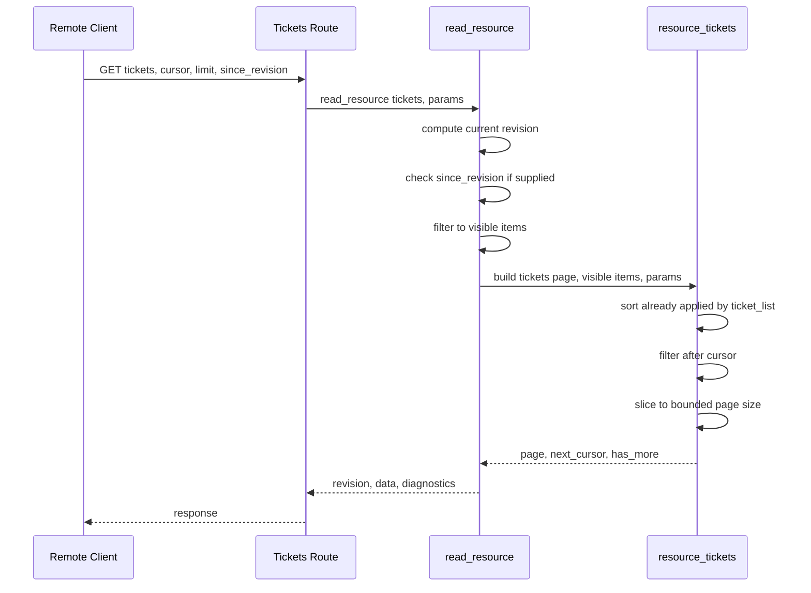

# Design Document

> **Authoritative copy lives in the change package, not here.** This change is Standard assurance
> and M-sized with a written split-justification (GitHub Issue #124), below the
> `.ai/project/changes/README.md` threshold — the issue and its pull request carry the
> authoritative record; this file is the working spec.

## Overview

**Purpose**: Bound the Remote `tickets` resource's default response size and add cursor pagination plus an opt-in cross-page consistency check, so large workspaces cannot be forced into one unbounded response and paginating clients can detect mid-sequence changes.

**Users**: Any Remote reader of `/api/remote/v1/tickets` or `/api/remote/v1/resources/tickets`.

**Impact**: Changes the `tickets` resource's default response size (compatibility-impacting for callers relying on receiving everything with no `limit`) and adds three new optional request parameters plus two new response fields.

### Goals
- Bounded default page size for `tickets` without changing the existing explicit-`limit` behavior or cap.
- Deterministic, gap-free, duplicate-free cursor pagination over the full visible set.
- Opt-in detection of cross-page workspace changes.

### Non-Goals
- Any resource other than `tickets`.
- ETag/cache-control/rate-limit/compression/retry semantics, SSE/WebSocket.
- Any write/mutation endpoint.

## Boundary Commitments

### This Spec Owns
- `_resource_tickets()`'s page-size default, cursor filtering, and `next_cursor`/`has_more` output.
- `read_resource()`'s `since_revision` consistency check, gated to the `tickets` resource.
- Documentation of the new parameters/fields for the `tickets` resource.

### Out of Boundary
- `_limit()` and every other resource builder that uses it (`items`, `links`, `agenda`, `search`) — unchanged.
- `remote_access.py`, authorization/session logic — untouched.
- Any transport-layer concern not already named in scope (ETag, compression, rate limiting).

### Allowed Dependencies
- `tickets.ticket_list()`'s existing deterministic ID sort.
- `remote_backend._visible_items()`'s existing permission filtering, which must continue to run before pagination.
- `remote_backend.source_revision()`.

### Revalidation Triggers
- `ticket_list()`'s sort key or order changes.
- `_visible_items()`'s filtering semantics change.
- A second resource needs the same treatment (would motivate factoring shared pagination logic out of `_resource_tickets()`, not attempted here per Simplification).

## Architecture

### Existing Architecture Analysis
`read_resource(name, paths, config, principal, params)` is the single dispatcher both Remote tickets routes go through: it reads and parses the workspace once, filters to `_visible_items(items, principal)`, calls the matching `_BUILDERS[name](visible, config, params)`, and wraps the builder's `data` with `schema`, `resource`, `revision` (`source_revision(paths)`), `generated_at`, and `diagnostics`. `_resource_tickets()` is the `tickets` builder: it calls `ticket_list()` (already ID-sorted), applies `project`/`status`/`assignee` filters, then `_limit()` (uncapped by default), and returns `{"count", "tickets"}`.

### Architecture Integration
- **Selected pattern**: extend both functions in place (see `research.md`, Architecture Pattern Evaluation).
- **Domain/feature boundaries**: all new logic stays inside `remote_backend.py`; no route handler in `remote_web.py` changes.
- **New components rationale**: none — no new module or route.
- **Steering compliance**: keeps Remote reads read-only and permission-filtered before any pagination decision, matching existing `_visible_items`-first ordering.

### Technology Stack

| Layer | Choice / Version | Role in Feature | Notes |
|-------|------------------|------------------|-------|
| Backend / Services | Python (stdlib only) | `_resource_tickets`/`read_resource` extension | No new dependency |

## File Structure Plan

### Modified Files
- `lifetxt/remote_backend.py` — add a `tickets`-specific default page size constant; change `_resource_tickets()` to accept `cursor`, use `_int()` directly for a bounded default, and return `next_cursor`/`has_more`; add the `since_revision` check to `read_resource()`, gated to `name == "tickets"`.
- `tests/` (existing Remote read-backend/resource test file(s)) — pagination, cursor, consistency-check, and permission-filter-ordering tests.
- `docs/en/remote.md`, `docs/ja/remote.md` — document the new parameters/fields on the `tickets` resource.
- `.ai/project/CAPABILITIES.yml`, `.ai/project/TRACEABILITY.yml` — capability/traceability registration (confirmed reuse-vs-new at implementation time).

### Not Modified
- `lifetxt/remote_web.py` — both existing routes already delegate to `read_resource()`; no route-level change needed (confirmed in `research.md`).
- `_limit()` and every other resource builder.

## System Flows



Key decision not visible in the diagram: the `since_revision` check happens before `_visible_items`/the builder run at all — a stale revision is rejected without doing any of the (comparatively expensive) read/filter/paginate work.

## Requirements Traceability

| Requirement | Summary | Components | Interfaces | Flows |
|-------------|---------|-------------|------------|-------|
| 1.1-1.3 | Bounded default page size | `_resource_tickets` | direct `_int()` call, not `_limit()` | Sequence diagram, "slice to bounded page size" |
| 2.1-2.4 | Cursor pagination | `_resource_tickets` | `cursor`/`next_cursor`/`has_more` | Sequence diagram, "filter after cursor" |
| 3.1-3.3 | Cross-page consistency | `read_resource` | `since_revision` | Sequence diagram, "check since_revision" |

## Components and Interfaces

| Component | Domain/Layer | Intent | Req Coverage | Key Dependencies (P0/P1) | Contracts |
|-----------|---------------|--------|---------------|----------------------------|-----------|
| `_resource_tickets` (extended) | `lifetxt.remote_backend` | Build one bounded, cursor-addressable page of visible tickets | 1.1-1.3, 2.1-2.4 | `ticket_list` (P0, existing sort) | Service |
| `read_resource` (extended) | `lifetxt.remote_backend` | Dispatch to a resource builder; now also enforces the opt-in revision-consistency check for `tickets` | 3.1-3.3 | `source_revision` (P0, existing) | Service |

### Remote Read Backend Domain

#### `_resource_tickets` (extended)

| Field | Detail |
|-------|--------|
| Intent | Build the `tickets` resource's `data` payload: filtered, cursor-paginated, bounded |
| Requirements | 1.1, 1.2, 1.3, 2.1, 2.2, 2.3, 2.4 |

**Responsibilities & Constraints**
- Must apply `cursor`/page-size after `project`/`status`/`assignee` filtering, and after the caller (`read_resource`) has already reduced `items` to `_visible_items` — pagination never sees a ticket the principal cannot read.
- Default page size applies only when `limit` is omitted; an explicit `limit` behaves exactly as before, including the existing 5000 cap.
- `next_cursor` is `None` whenever `has_more` is `False`.

**Dependencies**
- Inbound: `read_resource` (P0, sole caller)
- Outbound: `tickets.ticket_list` (P0, existing sort)

**Contracts**: Service [x] / API [ ] / Event [ ] / Batch [ ] / State [ ]

##### Service Interface
```python
_TICKETS_DEFAULT_PAGE_SIZE = 200

def _resource_tickets(items, config, params):
    """Return {"count", "tickets", "next_cursor", "has_more"} for one bounded,
    optionally cursor-continued page of the already-permission-filtered,
    already-ID-sorted ticket list. cursor, when given, returns only tickets
    sorting strictly after it. limit, when omitted, defaults to
    _TICKETS_DEFAULT_PAGE_SIZE rather than being unbounded.
    """
```
- Preconditions: `items` is already the permission-filtered, deterministically-ordered-by-ID set (guaranteed by `read_resource`/`ticket_list`).
- Postconditions: `len(tickets) == count <= limit`; `has_more == (count of tickets after cursor > len(tickets))`; `next_cursor` is the ID of the last returned ticket exactly when `has_more` is `True`, else `None`.
- Invariants: an explicit `limit` produces byte-identical `tickets`/`count` to the pre-feature implementation; only `next_cursor`/`has_more` are new keys.

**Implementation Notes**
- Integration: single function; no new call sites.
- Validation: page-boundary tests (exact multiple of page size, one short, one over), full-traversal test asserting no duplicates/gaps.
- Risks: none beyond `research.md`.

#### `read_resource` (extended)

| Field | Detail |
|-------|--------|
| Intent | Dispatch to a resource builder; enforce the opt-in `since_revision` check for `tickets` before doing any read/filter/paginate work |
| Requirements | 3.1, 3.2, 3.3 |

**Responsibilities & Constraints**
- The check applies only when `name == "tickets"` and `since_revision` is supplied and truthy; every other resource and every `tickets` call without `since_revision` is unaffected.
- Compute `revision` once, before the check, and reuse it for both the check and the response's `revision` field (no duplicate `source_revision` computation).

**Dependencies**
- Outbound: `source_revision` (P0, existing)

**Contracts**: Service [x] / API [ ] / Event [ ] / Batch [ ] / State [ ]

**Implementation Notes**
- Integration: one new conditional branch ahead of the existing read/filter/build sequence.
- Validation: matching-revision passthrough test, mismatched-revision distinct-error test, omitted-parameter regression test (identical to pre-feature behavior).
- Risks: none beyond `research.md`.

## Error Handling

### Error Strategy
- A stale `since_revision` is a distinct, named Remote error (not a generic 400/409 reused from elsewhere), so a client can specifically catch "my pagination state is stale" versus any other failure.
- Invalid `cursor`/`limit` values reuse the existing `REMOTE_PARAMETER_INVALID` pattern already used by `_int`/`_bool`/`_csv` elsewhere in this module — no new validation error shape introduced.

### Monitoring
No new logging; this is a synchronous request/response shape change.

## Testing Strategy

### Unit Tests
- Omitting `limit` returns at most `_TICKETS_DEFAULT_PAGE_SIZE` tickets for a workspace larger than that default — Requirement 1.1.
- An explicit `limit` within the existing range behaves identically to today (regression) — Requirement 1.2.
- `_visible_items` filtering is confirmed to run before pagination: a principal with a narrower grant gets a correctly bounded page over only what it can see, not the full-then-filtered set — Requirement 1.3.
- `cursor` returns only tickets after it in ID order — Requirement 2.1.
- Full traversal using reported `next_cursor` values visits every visible ticket exactly once — Requirement 2.4.
- Exact page-boundary and one-past-boundary cases both report `has_more`/`next_cursor` correctly — Requirement 2.2, 2.3.
- `since_revision` matching current revision behaves identically to omitting it — Requirement 3.2, 3.3.
- `since_revision` not matching produces the new distinct error, and no read/filter/paginate work result leaks into the error response — Requirement 3.1.

### Integration Tests
- A full request through the FastAPI `/api/remote/v1/tickets` route (or `/api/remote/v1/resources/tickets`) exercises pagination and the consistency check end-to-end, not just the unit-level function calls.
