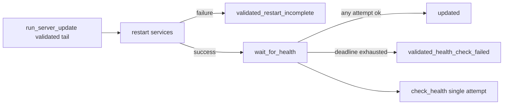

# Design Document

## Overview

This feature changes the final `server-update` health stage from a single request into bounded readiness waiting. It is targeted at production operators whose systemd service can be "started" before the HTTP server is listening.

The implementation keeps all existing update, validation, and restart safety behavior intact. Health retry starts only after code validation has passed and service restart has completed successfully.

### Goals

- Avoid false `validated_health_check_failed` reports during normal startup latency.
- Preserve existing failure classification for restart failures and genuinely unhealthy endpoints.
- Add useful health-check evidence and documented timing controls.

### Non-Goals

- No change to git, backup, reinstall, integrity, service stop/start, or rollback behavior.
- No new service manager behavior.
- No automatic rollback after health failure.

## Boundary Commitments

### This Spec Owns

- Post-restart health readiness retry.
- `server-update` health timing configuration.
- Health evidence fields in the returned report.
- Tests and deployment documentation for readiness behavior.

### Out of Boundary

- Service restart mechanics and `validated_restart_incomplete`.
- Pre-validation failure handling and service restoration.
- Production data safety checks and git mutation logic.

### Allowed Dependencies

- Existing `check_health()` single-attempt primitive.
- Existing `run_server_update()` orchestration and report structure.
- Standard library `time.monotonic` and `time.sleep`.

### Revalidation Triggers

- Changing `check_health()` result shape.
- Changing `server-update` status names.
- Changing service restart ordering.
- Changing config schema semantics for health timing.

## Architecture

### Existing Architecture Analysis

`run_server_update()` already has a clear validated tail:

```text
validation passes -> restart stopped services -> health check -> status
```

The retry behavior belongs in that tail and must not be called before restart failures have been classified.

### Architecture Pattern & Boundary Map

Selected pattern: small orchestration helper around an existing primitive.



### Technology Stack

| Layer | Choice / Version | Role in Feature | Notes |
|-------|------------------|-----------------|-------|
| CLI | Python >=3.10 | Existing `server-update` command | No new dependency |
| Runtime | systemd-managed service | Source of readiness race | Existing deployment profile |
| Network | `urllib.request.urlopen` | Health request primitive | Existing implementation |

## File Structure Plan

### Modified Files

- `lifetxt/server_update.py` - add config defaults, retry helper, dry-run fields, and orchestration call.
- `tests/test_server_update.py` - add deterministic unit tests for retry success/failure/evidence and orchestration.
- `docs/en/cli.md` - document config keys and dry-run/readiness behavior.
- `docs/deployment/ubuntu-server.md` - explain Ubuntu production readiness waiting.
- `.ai/project/changes/server-update-health-readiness/*` - High assurance change package.
- `.ai/project/TRACEABILITY.yml` and `.ai/project/CAPABILITIES.yml` - project traceability/capability records.

## Components and Interfaces

| Component | Domain/Layer | Intent | Req Coverage | Key Dependencies | Contracts |
|-----------|--------------|--------|--------------|------------------|-----------|
| `wait_for_health` | Operations orchestration | Retry health attempts until success or deadline | 1, 2 | `check_health`, clock/sleep | Service |
| `run_server_update` tail | CLI workflow | Invoke readiness waiting only after successful restart | 1 | service restart report | Batch |
| Config defaults | Deployment config | Provide conservative timing controls | 2 | JSON config merge | Data |
| Docs/tests | Evidence | Prove and explain behavior | 1, 2 | unittest, docs | Verification |

### Operations

#### `wait_for_health`

| Field | Detail |
|-------|--------|
| Intent | Convert repeated health attempts into one report record. |
| Requirements | 1, 2 |

**Responsibilities & Constraints**

- Return `None` when no health URL is configured.
- Call the single-attempt health function immediately.
- Return on first success.
- Retry failed results until `health_ready_timeout` is exhausted.
- Include `attempts`, `elapsed_seconds`, and timing fields in the returned record.
- Preserve the last `error`/`status_code`/`body` values from the final attempt.
- Cap each attempt's request timeout to the remaining readiness deadline.

##### Service Interface

```python
def wait_for_health(
    url,
    request_timeout,
    ready_timeout,
    retry_interval,
    health_checker=check_health,
    sleep=time.sleep,
    monotonic=time.monotonic,
):
    ...
```

## Error Handling

- A failed final health result remains non-raising and maps to `validated_health_check_failed`.
- Restart failures short-circuit before health retry and remain `validated_restart_incomplete`.
- Invalid or negative timing config is normalized conservatively; retry interval has a small positive floor so a zero value cannot create a tight retry loop.
- Each HTTP attempt uses the smaller of `health_timeout` and the remaining `health_ready_timeout`, so one slow request cannot overrun the total readiness deadline.

## Testing Strategy

### Unit Tests

- `check_health`/readiness helper immediate success returns one attempt.
- Connection refused/refused then success returns success with attempt count and elapsed evidence.
- Repeated failure until deadline returns failure with final error and attempt evidence.
- HTTP error then success retries successfully.

### Integration Tests

- `run_server_update()` returns `updated` when health fails transiently and later succeeds.
- Existing restart failure test proves health is not attempted on `validated_restart_incomplete`.
- Existing health failure status remains `validated_health_check_failed`.

### Security Considerations

This change adds waiting and repeated reads only. It must not introduce new writes, git operations, package installs, service actions, credential handling, or automatic rollback.
