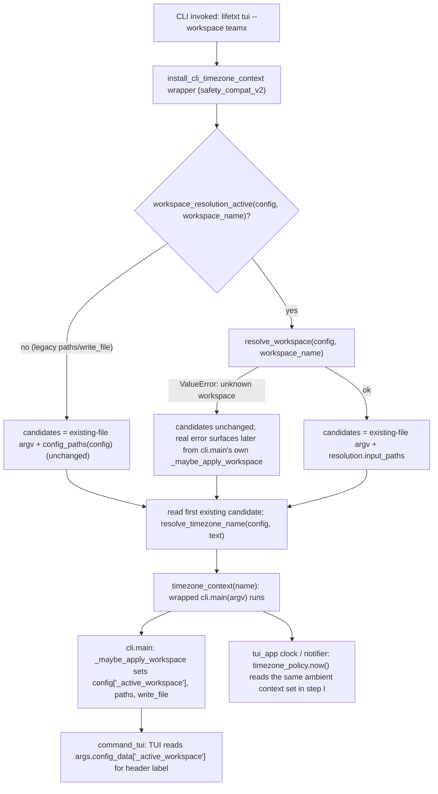

# Design Document

## Overview

**Purpose**: This feature makes the CLI-wide timezone-context bootstrap
workspace-aware, and gives `lifetxt tui` a visible indicator of the active
workspace, so that a named-workspace user's file-level `timezone:` directive
(and everything that depends on the resulting timezone context: the TUI
clock, notification timing classification) is resolved from the workspace
they actually selected.

**Users**: Users of `lifetxt` who configure named `workspaces` (or a
`default_workspace`) and use `--workspace` with any CLI command, especially
`lifetxt tui`.

**Impact**: Changes which candidate files the CLI's one-time timezone-context
bootstrap reads a `timezone:` directive from, when workspace resolution is
active. Adds one new small, publicly importable helper to
`lifetxt/workspace.py` and one to `lifetxt/timezone_policy.py`. Adds a
workspace-name label to two existing TUI header renderers. No configuration
schema, CLI flag, or public read/write path behavior changes.

### Goals
- The file-level `timezone:` directive search consults the active workspace's
  own resolved input files, not an unrelated legacy candidate list.
- `lifetxt tui` (and its plain-text fallback) show the active workspace name
  when one is resolved.
- The fix applies once, in the shared bootstrap, so the TUI clock and
  notification timing inherit it automatically -- no separate TUI-side
  timezone code path.

### Non-Goals
- No new configuration key (no per-workspace `timezone` override).
- No change to the existing timezone precedence order (CLI > file > config
  default > host).
- No Web API / MCP / Remote surface changes (separate follow-up).
- No in-session workspace switching inside a running TUI.

## Boundary Commitments

### This Spec Owns
- The candidate-file list used by the CLI-wide timezone-context bootstrap
  (`lifetxt/runtime_safety_v2.py` and its active replacement in
  `lifetxt/safety_compat_v2.py`) when workspace resolution is active.
- A small public accessor for "is workspace resolution active for this
  config" (moved from a private `cli.py` helper to `lifetxt/workspace.py` so
  the timezone bootstrap can reuse it instead of duplicating the predicate).
- The active-workspace label shown in `lifetxt tui`'s curses header
  (`lifetxt/tui_app.py`) and its plain-text dashboard header
  (`lifetxt/tui.py`).

### Out of Boundary
- `lifetxt/runtime_safety_v2.py`'s MCP (`_install_mcp_timezone_context`) and
  Web (`install_web_timezone_and_revision_context`) timezone installers --
  untouched by this spec; they already receive a request-scoped config
  through their own surfaces and are tracked separately if they need the same
  fix.
- Any change to `lifetxt/cli.py`'s `_maybe_apply_workspace`, which already
  correctly resolves `--workspace` for read/write paths -- this spec only
  reuses its "is workspace active" predicate, unchanged in behavior.
- Adding a `workspaces.<name>.timezone` (or similar) configuration override.
- `lifetxt/notifier.py` internals -- it already consumes the ambient timezone
  context; this spec does not modify that module.

### Allowed Dependencies
- `lifetxt.workspace.resolve_workspace` / `iter_workspace_definitions` /
  `default_workspace_name` (existing, unmodified contract).
- `lifetxt.config.config_paths` (existing, unmodified contract) as the
  non-workspace fallback.
- `lifetxt.safety_foundation.read_text_exact` (existing, unmodified) to read
  a candidate file's text.
- `lifetxt.timezone_policy.resolve_timezone_name` /
  `timezone_context` (existing, unmodified contract).

### Revalidation Triggers
- A change to `resolve_workspace`'s `input_paths` ordering or contents would
  change which file's `timezone:` directive wins for a workspace -- any such
  change must re-check this spec's candidate-selection behavior.
- A change to `_maybe_apply_workspace`'s "is workspace active" predicate must
  stay in sync with the moved-to-`workspace.py` public version this spec
  introduces (single source of truth after this change; see below).
- Adding a Web/MCP/Remote-side timezone bootstrap that also reads a file
  directive should reuse the same public workspace-resolution-active
  predicate rather than re-deriving it.

## Architecture

### Existing Architecture Analysis

- `lifetxt/entrypoint.py` `_legacy_main` wraps `lifetxt.cli.main` once per
  process with `install_cli_timezone_context`, imported fresh from
  `lifetxt.runtime_safety_v2` at call time. `lifetxt/__init__.py` calls
  `install_safety_compat_v2()` at package import time, which replaces
  `runtime_safety_v2.install_cli_timezone_context` with an
  almost-identical closure before `_legacy_main` ever looks it up -- so the
  compat version in `safety_compat_v2.py` is the one that actually runs
  today. Both must be fixed the same way; a shared helper (see below) is
  used so the fix is not duplicated.
- Both existing closures independently: (a) scan raw `argv` for `--config`,
  (b) `load_config`, (c) collect candidate files (existing-file positional
  args, then `config_paths(config)`), (d) read the first existing candidate's
  text, (e) `resolve_timezone_name(config, text=text)`, (f) run the wrapped
  `main` inside `timezone_context(name)`. Neither looks at `--workspace` or
  at workspace-resolved paths.
- `lifetxt/cli.py` `main()` separately extracts `--workspace` and calls
  `_maybe_apply_workspace(args)`, which resolves the active workspace and
  overwrites `args.config_data["paths"]` / `["write_file"]` / injects
  `args.config_data["_active_workspace"]`. This already works correctly for
  read/write paths -- it runs *after* the timezone bootstrap has already
  (mis)established its context, which is exactly the gap this spec closes.
- `lifetxt/tui.py` `command_tui` (invoked as `args.func`) uses
  `args.config_data` (by then workspace-resolved) to build `args.paths`, and
  passes `args` through to `lifetxt.tui.cmd_tui` / `lifetxt.tui_app.run_workspace`
  unchanged. `args.config_data["_active_workspace"]` therefore already
  reaches both TUI entry points; nothing currently reads it.
- `lifetxt/tui_app.py`'s only timezone touch point is
  `timezone_policy.now()` (module-level import aliased `timezone_now`); it
  never calls `timezone_context(...)` itself. `lifetxt/notifier.py` uses
  `timezone_policy.local_now_naive()` the same way. Both therefore already
  inherit whatever context the CLI bootstrap established -- confirming that
  fixing the bootstrap alone satisfies Requirement 2 with no TUI/notifier
  code changes.

### Architecture Pattern & Boundary Map



**Architecture Integration**:
- Selected pattern: extend the existing "resolve once, thread through
  contextvar" bootstrap pattern already used for timezone; no new pattern
  introduced.
- Domain/feature boundaries: workspace-resolution logic stays entirely in
  `lifetxt/workspace.py`; the timezone bootstrap only consumes its public
  surface (`workspace_resolution_active`, `resolve_workspace`).
- Existing patterns preserved: the two independent installer closures remain
  independent call sites (matching the project's precedent of tolerating
  small duplicated bootstrap code across `runtime_safety_v2.py` /
  `safety_compat_v2.py`), but now both delegate the actual candidate-file
  selection to one shared, independently testable function instead of
  duplicating that logic inline.
- New components rationale: `workspace_resolution_active` (public) removes a
  private cross-module dependency that would otherwise be needed twice;
  `cli_timezone_candidate_paths` gives the previously-untested
  candidate-selection logic a single, directly testable seam.
- Steering compliance: no new configuration setting (avoids triggering the
  project's "Configuration Setting Completion" documentation checklist);
  preserves old public CLI behavior for every case that is not
  workspace-active (`.ai/project/RULES.md` Design Principles).

### Technology Stack

| Layer | Choice / Version | Role in Feature | Notes |
|-------|------------------|-----------------|-------|
| CLI | Python stdlib (`argparse`-driven, no new deps) | Timezone bootstrap, TUI header rendering | Matches existing dependency-light constraint |

## File Structure Plan

### Modified Files
- `lifetxt/workspace.py` -- add public `workspace_resolution_active(config, workspace_name=None)` (logic moved from `cli.py`'s private `_workspace_resolution_active`, behavior unchanged) and public `active_workspace_name(config)` (returns `config.get("_active_workspace")` or `None`, single source of truth for that key).
- `lifetxt/cli.py` -- `_workspace_resolution_active` becomes a thin wrapper delegating to `lifetxt.workspace.workspace_resolution_active` (no behavior change; keeps the existing private name so its one call site in `_maybe_apply_workspace` is untouched).
- `lifetxt/timezone_policy.py` -- add `cli_timezone_candidate_paths(argv, config, workspace_name=None)`: builds the ordered candidate-file list (existing-file positional args, then workspace-resolved `input_paths` when active, else legacy `config_paths(config)`), swallowing an unknown-workspace `ValueError` by falling back to the legacy candidate list (the real error is still raised later by the wrapped command's own `_maybe_apply_workspace`).
- `lifetxt/runtime_safety_v2.py` -- `install_cli_timezone_context`'s inner `main` extracts `--workspace` from raw argv (mirroring its existing `--config` scan) and calls the new `cli_timezone_candidate_paths` instead of its inline candidate-building code.
- `lifetxt/safety_compat_v2.py` -- `_patch_cli_timezone_installer`'s inner `install_cli_timezone_context` gets the identical change (it is the version that actually runs; see Existing Architecture Analysis).
- `lifetxt/tui_app.py` -- `WorkspaceState.__init__` sets `self.active_workspace = workspace.active_workspace_name(getattr(args, "config_data", None) or {})`; `_build_header` appends a `workspace:<name>` segment to the tagline span when `state.active_workspace` is set.
- `lifetxt/tui.py` -- `render_modern_header` appends a `workspace:<name>` segment to its first header line when `workspace.active_workspace_name(getattr(args, "config_data", None) or {})` is set.

### New Files
- None. No new modules; all changes extend existing files along existing seams.

## Requirements Traceability

| Requirement | Summary | Components | Flows |
|-------------|---------|------------|-------|
| 1.1, 1.5, 1.6 | Workspace-priority-ordered candidates when `--workspace` given | `cli_timezone_candidate_paths`, both installer closures | Boundary map steps C/E/G/H/I |
| 1.2 | Legacy candidates unchanged with no workspace config | `cli_timezone_candidate_paths` (`workspace_resolution_active` false branch) | Boundary map step D |
| 1.3 | Default-workspace candidates when `--workspace` omitted but configured | `cli_timezone_candidate_paths`, `workspace_resolution_active`, `resolve_workspace(config, None)` | Boundary map step C (implicit active) |
| 1.4 | Unknown workspace: no silent fallback timezone used for real output | `cli_timezone_candidate_paths` (catches `ValueError`, defers to wrapped `main`'s own `_maybe_apply_workspace`) | Boundary map step F |
| 2.1, 2.2, 2.3 | TUI clock / notification timing inherit the fixed context, no separate TUI timezone path | (no code change; verified by Existing Architecture Analysis + tests) | Boundary map steps I/L |
| 3.1, 3.3 | Active workspace name shown in curses header and plain dashboard header | `WorkspaceState.active_workspace`, `_build_header`, `render_modern_header` | Boundary map step K |
| 3.2 | No label when workspace resolution is not active | `workspace.active_workspace_name` returns `None` when `_active_workspace` absent | -- |
| 3.4 | Label reflects only invocation-start state | No polling/refresh added; label set once in `WorkspaceState.__init__` / computed once per `render_modern_header` call | -- |
| 4.1, 4.2, 4.3 | No change to path/write-target resolution, no new config key, diagnostics unchanged | `_maybe_apply_workspace` untouched; `workspace_resolution_active` move is behavior-preserving | -- |

## Components and Interfaces

| Component | Domain/Layer | Intent | Req Coverage | Key Dependencies |
|-----------|--------------|--------|--------------|-------------------|
| `workspace.workspace_resolution_active` | workspace | Public predicate: is workspace resolution active for this config | 1.1-1.3 | none (pure config read) |
| `workspace.active_workspace_name` | workspace | Public accessor for the resolved active workspace's name | 3.1-3.3 | none (pure config read) |
| `timezone_policy.cli_timezone_candidate_paths` | CLI bootstrap | Build the ordered candidate-file list for the timezone directive search | 1.1-1.4 | `workspace`, `config.config_paths` |
| `runtime_safety_v2.install_cli_timezone_context` | CLI bootstrap | Legacy bootstrap closure (kept in sync with the compat version) | 1.1-1.6 | `timezone_policy.cli_timezone_candidate_paths` |
| `safety_compat_v2._patch_cli_timezone_installer` | CLI bootstrap | Active bootstrap closure that actually runs | 1.1-1.6 | `timezone_policy.cli_timezone_candidate_paths` |
| `tui_app.WorkspaceState` | TUI (curses) | Holds `active_workspace` for header rendering | 3.1, 3.2, 3.4 | `workspace.active_workspace_name` |
| `tui._build_header` (via `tui_app`) | TUI (curses) | Renders the workspace label into the header span | 3.1, 3.2 | `WorkspaceState.active_workspace` |
| `tui.render_modern_header` | TUI (plain) | Renders the workspace label into the plain dashboard header | 3.3 | `workspace.active_workspace_name` |

### workspace module

#### `workspace_resolution_active`

| Field | Detail |
|-------|--------|
| Intent | Return whether `--workspace`/config makes workspace resolution the active source of truth for this config |
| Requirements | 1.1, 1.2, 1.3 |

**Contracts**: Service [x]

```python
def workspace_resolution_active(config, workspace_name=None):
    """True when a named workspace (explicit or configured default) applies."""
```
- Preconditions: `config` is a `dict` or `None`.
- Postconditions: Returns `True` iff `workspace_name` is truthy, or `config` declares a non-empty `workspaces` mapping, or `config` declares `default_workspace`.
- Invariants: Identical truth table to the `cli.py` predicate it replaces (behavior-preserving move, not a new rule).

#### `active_workspace_name`

| Field | Detail |
|-------|--------|
| Intent | Read back the workspace name `_maybe_apply_workspace` already injected into config |
| Requirements | 3.1, 3.2, 3.3 |

**Contracts**: Service [x]

```python
def active_workspace_name(config):
    """Return config.get('_active_workspace') if config is a dict, else None."""
```

### timezone_policy module

#### `cli_timezone_candidate_paths`

| Field | Detail |
|-------|--------|
| Intent | Ordered candidate files for the file-level `timezone:` directive search |
| Requirements | 1.1, 1.2, 1.3, 1.4, 1.5 |

**Contracts**: Service [x]

```python
def cli_timezone_candidate_paths(argv, config, workspace_name=None):
    """Existing-file positional args, then workspace-or-legacy input paths."""
```
- Preconditions: `argv` is the raw (unfiltered) argument list; `config` is the loaded config dict.
- Postconditions: Returns a `list[str]`. When `workspace_resolution_active` is true and the workspace resolves, workspace `input_paths` (already priority-ordered by `resolve_workspace`) follow the existing-file positional-argument candidates. When it is false, `config_paths(config)` follows them unchanged (today's behavior). When the named workspace does not exist, falls back to `config_paths(config)` rather than raising -- the authoritative error still comes from the wrapped command's own `_maybe_apply_workspace`.
- Invariants: Never raises for a resolvable config; never mutates `config`.

## Error Handling

### Error Strategy
- Unknown-workspace errors are surfaced exactly once, by the already-existing
  `_maybe_apply_workspace` inside the wrapped command (`cli.main`), which
  runs immediately after the timezone bootstrap. `cli_timezone_candidate_paths`
  deliberately does not re-raise: doing so would print (or risk mis-format)
  the error a second time, or in a place inconsistent with today's `ERROR:
  %s` formatting in `cli.main`. The transient fallback timezone context
  established before the real error aborts the command is never used to
  produce output, satisfying Requirement 1.4's "no silent fallback" in
  effect: the user still sees the one authoritative error and non-zero exit.
- A candidate file that exists but cannot be read (`OSError`) is skipped,
  exactly like today's behavior (existing `except OSError: continue`).

### Monitoring
No new logging/telemetry; out of scope for a CLI/TUI-local bugfix.

## Testing Strategy

- **Unit -- `workspace.workspace_resolution_active` / `active_workspace_name`**:
  moved/added predicate returns correct results for (a) no workspace config,
  (b) `workspaces` mapping present, (c) `default_workspace` set, (d) explicit
  `workspace_name` argument regardless of config shape; `active_workspace_name`
  returns `None` for a non-dict/empty config and the injected value otherwise.
- **Unit -- `timezone_policy.cli_timezone_candidate_paths`**: legacy config
  returns `config_paths` unchanged (Req 1.2); explicit `--workspace` returns
  that workspace's `input_paths` in priority order (Req 1.1, 1.5); no
  explicit `--workspace` but a configured default workspace returns the
  default's `input_paths` (Req 1.3); an unknown workspace name falls back to
  `config_paths` rather than raising (Req 1.4); an existing-file positional
  arg still comes first in all cases (Req 1.6 precedence preserved).
- **Integration -- installer closures**: for both
  `runtime_safety_v2.install_cli_timezone_context` and
  `safety_compat_v2`'s replacement, invoking the wrapped `main` with
  `--workspace <name>` against a fixture config whose named workspace's
  primary source carries a `timezone:` directive establishes that timezone
  in `timezone_policy.current_timezone_name()` during the wrapped call (Req
  1.1, 1.6); an unknown `--workspace` still produces the CLI's existing
  "Unknown workspace" `ERROR:` output and non-zero exit, not a stack trace or
  silently-different timezone-affected output (Req 1.4).
- **Integration -- TUI clock/notifications inherit the fixed context**: with
  a workspace-resolved config carrying a distinctive `timezone:` directive,
  `tui_app`'s rendered clock text and `notifier`'s overdue/notification
  classification for a boundary-case item reflect that timezone during the
  same invocation (Req 2.1, 2.2).
- **Unit -- TUI header rendering**: `tui_app._build_header` /
  `tui_app.WorkspaceState` include the workspace name in header output when
  `args.config_data["_active_workspace"]` is set, and omit any workspace
  label when it is absent (Req 3.1, 3.2); `tui.render_modern_header` /
  `tui.render_dashboard` show the same for the plain-text fallback (Req 3.3).
- **Regression**: full existing `tests/test_cui_extensions.py`,
  `tests/test_timezone_policy_v2.py`, `tests/test_timezone_clock_v3.py`,
  `tests/test_workspace_foundation.py` suites continue to pass unmodified
  where they exercise behavior this spec does not change (Req 4.1-4.3).
