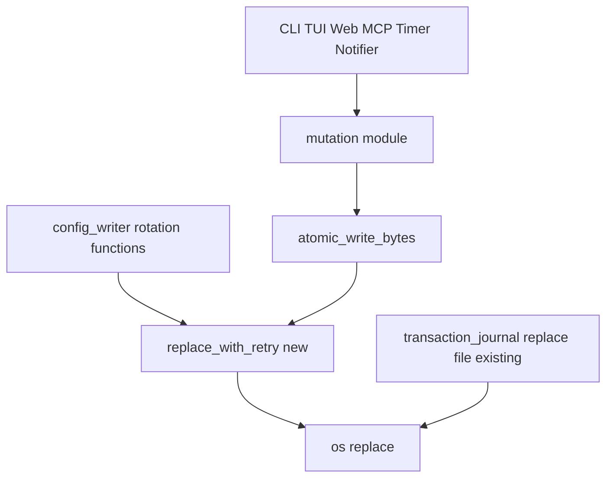
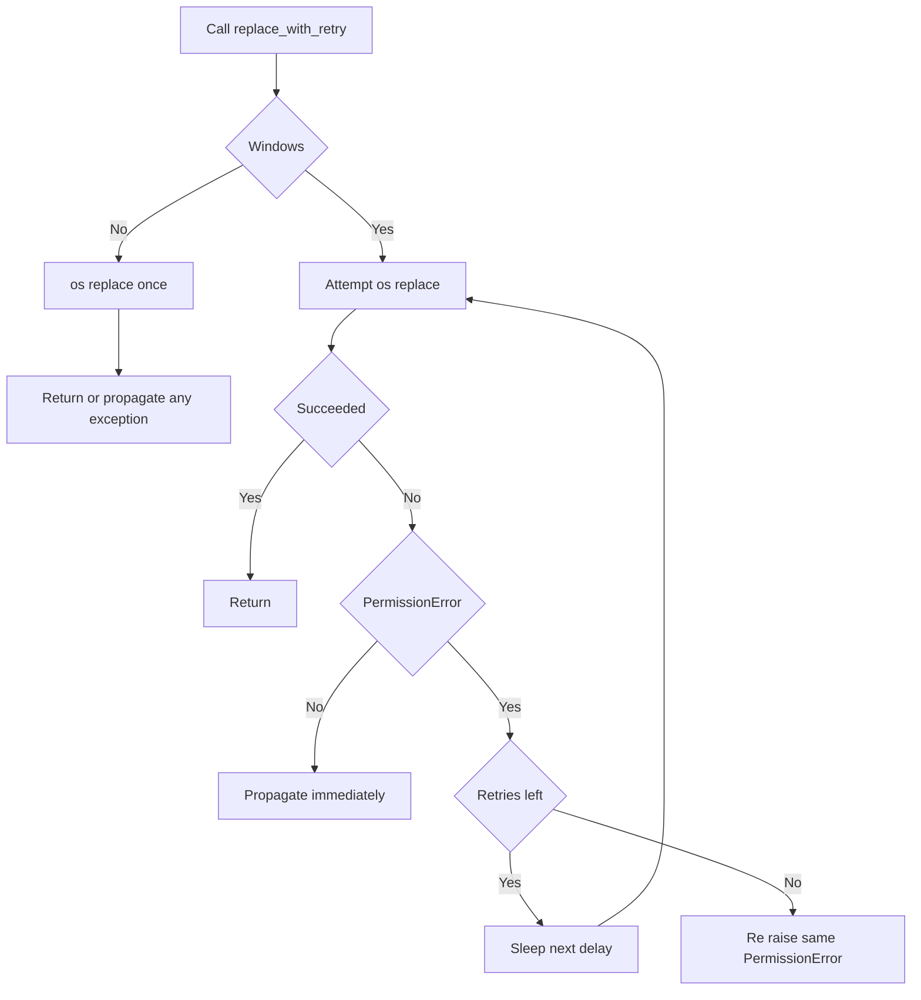

# Design Document

> Sections may be reordered when it improves clarity. Within each section, the flow is
> **Summary → Scope → Decisions → Impacts/Risks**.

## Overview

本機能は、Windows 上で `os.replace` が一時的なファイルハンドル競合により `PermissionError`
（`WinError 5`）で失敗する既知の事象（#96）に対し、`transaction_journal.py` の
`_replace_file()`（#86 / #94）で既に確立済みのバウンデッドリトライ方針を、現時点で無保護な
残り2つの置換呼び出し経路に適用する。

**Purpose**: Windows 上で lifetxt のあらゆる書き込みを行うユーザーおよび設定ファイルのバック
アップ／復旧に依存する運用者に対して、短命なファイルハンドル競合だけを理由に書き込みやローテ
ーションが不必要に失敗しない信頼性を提供する。
**Users**: Windows 上で CLI・TUI・Web・MCP・タイマー・通知・設定コマンドのいずれかを実行する
すべてのユーザーと運用者が対象となる（`atomic_write_bytes` はプロジェクト内のほぼ全ての永続化
書き込みが経由する共有原始関数のため）。
**Impact**: `lifetxt/atomic.py` の共有コミット原始関数と `lifetxt/config_writer.py` のバック
アップ／rejected 候補ローテーションの2箇所に、新しい共有リトライヘルパーを介したリトライを追
加する。`transaction_journal.py` は変更しない。

### Goals
- `atomic.py:73`（`atomic_write_bytes`）の置換ステップに、Windows 限定のバウンデッドリトライ
  を追加する。
- `config_writer.py:96` / `config_writer.py:125`（バックアップ／rejected 候補ローテーション）
  の置換ステップに、同一のバウンデッドリトライを追加する。
- 上記3経路すべてで、リトライ試行回数・待機間隔・対象プラットフォームを完全に一致させる、単一
  の共有実装を導入する。

### Non-Goals
- `transaction_journal.py:962` の既存保護（#86 / #94）を変更・リファクタリングすること。
- リトライの試行回数・待機間隔の値そのものを再設計すること（既存値をそのまま流用する）。
- `config_writer.py` のローテーション失敗を新たに可観測にすること（ログ、`lifetxt doctor` 診
  断、戻り値の追加など）。
- Windows 以外のプラットフォームの挙動を変更すること。
- `os.replace` を直接呼び出す、本設計が対象とする3箇所・既保護1箇所以外の経路を保護すること
  （該当箇所は存在しないことを確認済み — `research.md` 参照）。

## Boundary Commitments

### This Spec Owns
- `lifetxt/atomic.py` 内の新しい共有リトライヘルパー `replace_with_retry(source, destination)`
  と、そのリトライポリシーを定義する2つのモジュール定数。
- `atomic_write_bytes`（`lifetxt/atomic.py`）の置換ステップの実装（ヘルパーを呼び出すよう変更）。
- `_rotate_backups` / `_retain_rejected`（`lifetxt/config_writer.py`）の置換ステップの実装
  （ヘルパーを呼び出すよう変更）。
- 上記3経路すべてに対して、リトライ試行回数・待機間隔・対象プラットフォーム（Windows 限定）を
  一致させること。

### Out of Boundary
- `lifetxt/transaction_journal.py` の `_replace_file()` およびそのリトライ定数
  （`_REPLACE_PERMISSION_RETRY_OS_NAMES` / `_REPLACE_PERMISSION_RETRY_DELAYS_SECONDS`）— 既存
  実装のまま変更しない。値は本設計の新しいヘルパーと一致させるが、コードは共有しない
  （`research.md` の Decision 参照）。
- `lifetxt/mutation.py` の共有ロック・競合検出・書き込み後検証の契約 — 変更しない。リトライは
  置換ステップの内部でのみ発生する。
- `config.write.require_revision` を含む設定の compare-and-set（リビジョン照合）契約
  （`cap-config-safe-writes`）— 変更しない。
- `lifetxt doctor --workspace-safety` が拒否された候補（rejected candidates）を情報として報告
  する既存の仕組み — 変更しない。これはローテーション処理の成功後に保持された候補を報告するも
  ので、ローテーションの置換失敗そのものとは別の既存メカニズムである。

### Allowed Dependencies
- `lifetxt/atomic.py` は標準ライブラリ（`os`, `time`）以外に依存しない（現状維持）。
- `lifetxt/config_writer.py` は `lifetxt/atomic.py` から `replace_with_retry` を追加でインポ
  ートしてよい（既に `atomic_write_text` をインポートしている既存の依存方向と同じ）。
- `lifetxt/transaction_journal.py` から `lifetxt/atomic.py` への新しい依存は導入しない。

### Revalidation Triggers
- `lifetxt/atomic.py` の `replace_with_retry` のシグネチャまたは戻り値・例外契約が変わる場合。
- リトライポリシー（試行回数・待機間隔・対象 OS）の値が変わる場合 — `transaction_journal.py`
  側の値との整合が崩れるため、再検証が必要。
- `_rotate_backups` / `_retain_rejected` の既存の `except OSError: pass` による例外処理方針が
  変わる場合（例: 将来ローテーション失敗を可観測にする変更が入る場合）。
- `atomic_write_bytes` の呼び出し契約（例外伝播方針）が変わる場合 — 本機能に依存する全ての上位
  呼び出し元（CLI・TUI・Web・MCP・タイマー・通知等）に影響する。

## Architecture

### Existing Architecture Analysis

- `lifetxt/atomic.py` は本プロジェクトの最下層モジュールであり、内部 (`lifetxt.*`) への依存を
  一切持たない。`atomic_write_bytes` は `lifetxt/mutation.py` が内部的に使用する低レベルコミッ
  ト原始関数で、CLI・TUI・Web・MCP・タイマー・通知など、ほぼ全ての永続化書き込みが最終的にこ
  こを経由する。
- `lifetxt/config_writer.py` は既に `lifetxt/atomic.py`（`atomic_write_text`）と
  `lifetxt/mutation.py` の両方に依存しており、設定の compare-and-set 書き込みとバックアップ／
  rejected 候補のベストエフォートローテーションを担う。
- `lifetxt/transaction_journal.py` は `lifetxt/mutation.py` と `lifetxt/transaction_policy.py`
  に依存するが `lifetxt/atomic.py` には依存しない、独立した経路である。ここだけが既に
  `_replace_file()` でバウンデッドリトライ保護済み（#86 / #94）。
- 対処する技術的負債: `atomic_write_bytes` と `config_writer.py` の2つの置換ステップだけが無保
  護のまま残っており、#96 で実際に一度、単体テスト実行中の一時的な `PermissionError` として顕
  在化した。

### Architecture Pattern & Boundary Map

**Architecture Integration**:
- 選択したパターン: 既存の最下層モジュール（`atomic.py`）に単一の共有リトライヘルパーを追加し、
  無保護だった2経路がそれを呼び出す（`research.md` の Decision で比較検討した4案から選定）。
- ドメイン境界: リトライポリシーの実装は `atomic.py` が単独で所有する。呼び出し元
  （`atomic_write_bytes` 自身、および `config_writer.py` のローテーション関数）は、リトライ後
  の例外を今まで通り自分自身の既存のエラー処理方針（伝播 vs 黙って継続）で扱うだけで、ヘルパー
  自体は呼び出し元ごとに分岐しない。
- 保持される既存パターン: `transaction_journal.py` の独立した既存保護、`config_writer.py` の
  ベストエフォート例外処理（`except OSError: pass`）、`atomic_write_bytes` の例外伝播契約。
- 新規コンポーネントの理由: `replace_with_retry` は、3箇所で同一のリトライ契約を保証するために
  必要な、唯一の新規コンポーネント。
- Steering 準拠: 依存方向（`atomic` → `mutation` → 上位呼び出し元）を変更せず、
  `AI_TOOL_COMPATIBILITY.md` が求める最小限の変更範囲を維持する。



- `replace_with_retry` は `atomic.py` 内の新規コンポーネントで、`atomic_write_bytes` と
  `config_writer.py` の両方から呼ばれる唯一の共有実装。
- `transaction_journal.py` は既存の独立した実装のまま、`os.replace` を直接呼び出し続ける
  （変更なし、値のみ一致）。

### Technology Stack

| Layer | Choice / Version | Role in Feature | Notes |
|-------|------------------|-----------------|-------|
| Storage / Runtime | Python 標準ライブラリ `os`, `time`（既存 `atomic.py` に `time` を追加） | `os.replace` のリトライループとウェイト | 新規外部依存は追加しない |

## File Structure Plan

### Modified Files
- `lifetxt/atomic.py` — モジュール先頭に `import time` を追加。リトライポリシー定数
  `_REPLACE_PERMISSION_RETRY_OS_NAMES`（値: `frozenset(("nt",))`）と
  `_REPLACE_PERMISSION_RETRY_DELAYS_SECONDS`（値: `(0.01, 0.05, 0.1, 0.25)`、
  `transaction_journal.py` と同一値）を追加。新関数 `replace_with_retry(source, destination)`
  を追加。`atomic_write_bytes` 内の `os.replace(temp_path, path)` 呼び出しを
  `replace_with_retry(temp_path, path)` に置き換える。
- `lifetxt/config_writer.py` — `from .atomic import atomic_write_text` の行に
  `replace_with_retry` を追加してインポート。`_rotate_backups` 内の
  `os.replace(older, newer)`（既存の `try/except OSError: pass` の内側、行96相当）と
  `_retain_rejected` 内の同型の呼び出し（行125相当）を、それぞれ
  `replace_with_retry(older, newer)` に置き換える。周囲の `try/except OSError: pass` はその
  まま変更しない。
- `tests/test_mutation.py` — `replace_with_retry` のリトライ成功／予算枯渇／非 Windows スキッ
  プ／非 `PermissionError` 非リトライの単体テストと、`atomic_write_bytes` がヘルパーに委譲する
  ことを確認する結合テストを追加（既存の `MutationTests` クラスに追加、または同ファイル内に新
  規テストクラスを追加）。
- `tests/test_config_validation.py` — `_rotate_backups` / `_retain_rejected` がリトライ後に成
  功するケースと、リトライ予算を使い切っても既存通り例外を発生させず設定書き込みが完了するケー
  スの結合テストを追加（既存の rotation 関連テストが置かれているクラスに追加）。

新規ファイルは作成しない。

## Requirements Traceability

| Requirement | Summary | Components | Interfaces | Flows |
|-------------|---------|------------|------------|-------|
| 1.1 | Windows 上で共有コミット原始関数がアクセス拒否エラーをリトライする | Replace Retry Primitive, Atomic Write Commit Primitive | `replace_with_retry`, `atomic_write_bytes` | Retry Loop Flow |
| 1.2 | リトライ予算内で成功すれば初回成功と同じ結果になる | Replace Retry Primitive, Atomic Write Commit Primitive | `replace_with_retry`, `atomic_write_bytes` | Retry Loop Flow |
| 1.3 | 予算枯渇時は既存通りエラーを呼び出し元へ伝播する | Atomic Write Commit Primitive | `atomic_write_bytes` | Retry Loop Flow |
| 1.4 | 非 Windows ではリトライを適用しない | Replace Retry Primitive | `replace_with_retry` | Retry Loop Flow |
| 2.1 | バックアップローテーションがアクセス拒否エラーをリトライする | Configuration Backup and Rejected Rotation | `_rotate_backups` | Retry Loop Flow |
| 2.2 | rejected 候補ローテーションがアクセス拒否エラーをリトライする | Configuration Backup and Rejected Rotation | `_retain_rejected` | Retry Loop Flow |
| 2.3 | 予算枯渇時も既存通り例外を送出せず継続する | Configuration Backup and Rejected Rotation | `_rotate_backups`, `_retain_rejected` | Retry Loop Flow |
| 2.4 | 新しい可観測化を追加しない | Configuration Backup and Rejected Rotation | （変更なしであること自体が契約） | — |
| 3.1 | 経路1・2で同一のリトライポリシーを適用する | Replace Retry Primitive | `_REPLACE_PERMISSION_RETRY_*` 定数 | Retry Loop Flow |
| 3.2 | 追加待機時間を既存予算（約0.41秒）に収める | Replace Retry Primitive | `_REPLACE_PERMISSION_RETRY_DELAYS_SECONDS` | Retry Loop Flow |
| 3.3 | 非 Windows では追加待機なし | Replace Retry Primitive | `replace_with_retry` | Retry Loop Flow |

## Components and Interfaces

| Component | Domain/Layer | Intent | Req Coverage | Key Dependencies (P0/P1) | Contracts |
|-----------|--------------|--------|---------------|---------------------------|-----------|
| Replace Retry Primitive | Storage / `lifetxt/atomic.py` | `os.replace` を Windows 限定のバウンデッドリトライでラップする共有関数 | 1.1, 1.2, 1.4, 3.1, 3.2, 3.3 | なし（標準ライブラリのみ） | Service |
| Atomic Write Commit Primitive | Storage / `lifetxt/atomic.py` | 既存の低レベル書き込みコミット関数。置換ステップを Replace Retry Primitive に委譲する | 1.1, 1.2, 1.3 | Replace Retry Primitive (P0) | Service |
| Configuration Backup and Rejected Rotation | Storage / `lifetxt/config_writer.py` | 既存のベストエフォート `.bak` / `.rejectedN` ローテーション。置換ステップを Replace Retry Primitive に委譲する | 2.1, 2.2, 2.3, 2.4 | Replace Retry Primitive (P0) | Service |

### Storage / lifetxt/atomic.py

#### Replace Retry Primitive

| Field | Detail |
|-------|--------|
| Intent | `os.replace` 呼び出しを、Windows 上での一時的なアクセス拒否エラーに対してのみバウンデッドリトライする |
| Requirements | 1.1, 1.2, 1.4, 3.1, 3.2, 3.3 |

**Responsibilities & Constraints**
- リトライポリシー（試行回数・待機間隔・対象 OS）の唯一の実装を所有する。
- `PermissionError` 以外の例外（他の `OSError` サブタイプを含む）はリトライせず即座に伝播する。
- 呼び出し元ごとの分岐ロジックを持たない — 呼び出し元の既存のエラー処理（伝播するか黙って継続
  するか）だけが最終的な観測挙動を決める。

**Dependencies**
- Outbound: なし（標準ライブラリ `os`, `time` のみ）。

**Contracts**: Service [x] / API [ ] / Event [ ] / Batch [ ] / State [ ]

##### Service Interface
```python
def replace_with_retry(source, destination):
    """os.replace(source, destination) を実行し、Windows 上での一時的なアクセス拒否エラーを
    バウンデッドリトライする。"""
```
- Preconditions: `source` は既存のファイルパスであり、`destination` と同一ファイルシステム上
  にあること（`os.replace` 自体の前提条件と同一）。
- Postconditions: 正常終了時、`destination` は `source` の内容を持ち、`source` は元のパスに存
  在しない（成功時の観測結果は素の `os.replace(source, destination)` と完全に同一）。
- Invariants:
  - リトライは `os.name in _REPLACE_PERMISSION_RETRY_OS_NAMES`（値: `frozenset(("nt",))`）の場
    合にのみ発生する。それ以外では最初の失敗で即座に例外を送出する。
  - 総試行回数は「初回 + `len(_REPLACE_PERMISSION_RETRY_DELAYS_SECONDS)` 回のリトライ」
    （値: `(0.01, 0.05, 0.1, 0.25)` 秒 → 初回 + 最大4回、追加待機時間の合計は約0.41秒）。
  - 各リトライの直前に、対応する秒数だけ `time.sleep` で待機する。
  - リトライ対象は `PermissionError` のみ。予算を使い切った最後の試行で送出された、まさにその
    `PermissionError` インスタンスをそのまま再送出する（新しい例外でラップしない）。

**Implementation Notes**
- Integration: `atomic_write_bytes`（同一モジュール内）と `config_writer.py` の2関数から呼ば
  れる。呼び出し元は追加の import 以外の変更を必要としない。
- Validation: `tests/test_mutation.py` で `os.replace` と `time.sleep` をモックし、成功・予算
  枯渇・非 Windows・非 `PermissionError` の4パターンを検証する（`research.md` 参照）。
- Risks: なし（`research.md` の Risks & Mitigations を参照）。

#### Atomic Write Commit Primitive（既存コンポーネント、変更箇所のみ記載）

| Field | Detail |
|-------|--------|
| Intent | 一時ファイルへの書き込みから最終パスへの置換までを担う、既存の低レベルコミット関数 |
| Requirements | 1.1, 1.2, 1.3 |

**Responsibilities & Constraints**
- 置換ステップ（`os.replace(temp_path, path)`）を Replace Retry Primitive の呼び出しに置き換え
  る以外、既存の責務（一時ファイル作成・fsync・パーミッション引き継ぎ・クリーンアップ）は変更
  しない。
- 予算枯渇時、Replace Retry Primitive が再送出した `PermissionError` は既存の `finally` ブロッ
  クによる一時ファイルクリーンアップを経て、呼び出し元へそのまま伝播する（変更なし）。

**Dependencies**
- Outbound: Replace Retry Primitive (P0) — 同一モジュール内の関数呼び出し。

**Contracts**: Service [x] / API [ ] / Event [ ] / Batch [ ] / State [ ]

##### Service Interface
既存シグネチャ `atomic_write_bytes(path, data)` は変更しない。
- Preconditions: 既存のまま（`data` は `bytes`）。
- Postconditions: 既存のまま。
- Invariants: 置換失敗時の最終的な例外伝播契約は変更しない（Replace Retry Primitive がリトライ
  後に再送出した例外がそのまま伝播する）。

**Implementation Notes**
- Integration: 呼び出し元（`mutation.py` 経由で CLI・TUI・Web・MCP・タイマー・通知等）に対する
  観測可能な契約変更はない。
- Validation: `tests/test_mutation.py` に、`os.replace` を一時的に失敗させて最終的に成功する
  ケースと、予算枯渇で例外が伝播するケースの結合テストを追加。
- Risks: なし（`research.md` の Risks & Mitigations を参照）。

### Storage / lifetxt/config_writer.py

#### Configuration Backup and Rejected Rotation（既存コンポーネント、変更箇所のみ記載）

| Field | Detail |
|-------|--------|
| Intent | `.bak` 世代バックアップと `.rejectedN` 拒否候補の、ベストエフォートなローテーション |
| Requirements | 2.1, 2.2, 2.3, 2.4 |

**Responsibilities & Constraints**
- `_rotate_backups` と `_retain_rejected` それぞれの内部の `os.replace(older, newer)` 呼び出し
  を Replace Retry Primitive に置き換える以外、既存の責務・世代数上限
  （`DEFAULT_MAX_BACKUPS`/`DEFAULT_MAX_REJECTED`）・ファイル命名規則は変更しない。
- 既存の `try/except OSError: pass` は変更しない。Replace Retry Primitive がリトライ予算枯渇時
  に再送出する `PermissionError` は `OSError` のサブタイプであるため、この既存の except 節にそ
  のまま捕捉され、既存通り黙って継続する。

**Dependencies**
- Outbound: Replace Retry Primitive (P0) — `lifetxt.atomic` からの関数呼び出し。

**Contracts**: Service [x] / API [ ] / Event [ ] / Batch [ ] / State [ ]

##### Service Interface
既存シグネチャ `_rotate_backups(path, max_backups)` および
`_retain_rejected(path, text, max_rejected=DEFAULT_MAX_REJECTED)` は変更しない。
- Preconditions: 既存のまま。
- Postconditions: 既存のまま（ローテーション成功時、失敗時とも観測可能な戻り値契約は変更しな
  い）。
- Invariants: リトライ予算を使い切っても、これら2関数は例外を上位（`write_config` 呼び出し元）
  へ伝播しない（変更なし）。設定書き込み操作自体は成功する。

**Implementation Notes**
- Integration: `write_config`（`config_writer.py` の公開エントリポイント）に対する観測可能な契
  約変更はない。
- Validation: `tests/test_config_validation.py` に、`os.replace` を一時的に失敗させて最終的に
  ローテーションが成功するケースと、予算枯渇後も設定書き込みが例外なく完了し、既存の
  `test_rejected_rotation_is_bounded` 等と同様の世代数境界を満たすケースの結合テストを追加。
- Risks: なし（`research.md` の Risks & Mitigations を参照）。

## System Flows

### Retry Loop Flow



- 非 Windows では即座に1回だけ実行し、リトライも追加待機も発生しない（1.4, 3.3）。
- `PermissionError` 以外は即座に伝播し、リトライしない。
- 予算を使い切った最後の失敗は、元の例外インスタンスをそのまま再送出する（1.3, 2.3 の土台とな
  る挙動。実際に伝播するか黙って継続するかは、呼び出し元の既存のエラー処理で決まる）。

## Error Handling

### Error Strategy
Replace Retry Primitive は単一の一貫したリトライ契約のみを持つ。呼び出し元ごとの挙動差は、呼
び出し元が既に持っている既存のエラー処理（伝播 vs 黙って継続）から生じるものであり、本機能が
新しく導入するものではない。

### Error Categories and Responses
- **一時的なアクセス拒否（Windows, `PermissionError`）**: リトライ予算内で発生した場合は自動的
  にリトライされ、観測可能な失敗にはならない。
- **予算枯渇（共有コミット原始関数経由, Requirement 1）**: 既存通り `PermissionError` が呼び出
  し元へ伝播する。本機能はこの伝播の有無・種類を変更しない。
- **予算枯渇（設定ローテーション経由, Requirement 2）**: 既存の `except OSError: pass` に捕捉さ
  れ、設定書き込み操作は成功したまま完了する。新しいログ・診断・戻り値は追加しない。
- **`PermissionError` 以外の `OSError`（任意の経路）**: リトライされず、各呼び出し元の既存の挙
  動（伝播 or 黙って継続）がそのまま適用される（変更なし）。

### Monitoring
本機能は新しいログ・メトリクス・診断出力を追加しない（Non-Goals 参照）。既存の
`lifetxt doctor` 診断・ログ出力の挙動は変更しない。

## Testing Strategy

### Unit Tests
1. `replace_with_retry` は失敗が発生しない場合、リトライも `time.sleep` 呼び出しも発生させず即
   座に成功する（1.2 のベースライン）。
2. Windows を模擬した環境で、`os.replace` が `PermissionError` を2回送出した後に成功した場合、
   `replace_with_retry` は3回目の試行で成功し、`time.sleep` が期待される2回の遅延値で呼ばれる
   （1.1, 3.1, 3.2）。
3. Windows を模擬した環境で、`os.replace` が常に `PermissionError` を送出する場合、初回+4回の
   合計5回試行した後、同じ `PermissionError` を再送出する（1.3, 3.2）。
4. 非 Windows を模擬した環境では、`PermissionError` が発生してもリトライせず、`time.sleep` が
   一度も呼ばれずに即座に例外が伝播する（1.4, 3.3）。
5. `PermissionError` 以外の `OSError` は、Windows 環境であってもリトライされず即座に伝播する
   （1.1 / 1.3 の境界を裏付ける）。

### Integration Tests
6. `atomic_write_bytes` は、`os.replace` が一時的に失敗した後に成功する場合、最終的に新しいバ
   イト列でファイルを置換し、一時ファイルを残さない（1.1, 1.2）。
7. `atomic_write_bytes` は、リトライ予算が枯渇した場合、既存通り `PermissionError` を呼び出し
   元へ伝播し、元のファイル内容は変更されず、一時ファイルは既存の `finally` によりクリーンアッ
   プされる（1.3）。
8. `_rotate_backups` は、`.bak` 世代の置換が一時的に失敗した後に成功する場合、ローテーションが
   最終的に完了する（2.1）。
9. `_rotate_backups` と `_retain_rejected` は、リトライ予算が枯渇しても例外を送出せず、
   `write_config` を呼び出す設定書き込み操作全体が正常に完了する（既存の
   `test_rejected_rotation_is_bounded` と同様に世代数上限も満たすことを確認）（2.3, 2.4）。
10. `_retain_rejected` は、`.rejectedN` の置換が一時的に失敗した後に成功する場合、保持された候
    補が既存の `rejected_candidates()` から引き続き発見可能である（2.2）。

### Performance/Load
11. リトライ予算を使い切った場合に `replace_with_retry` が追加する合計待機時間が、固定の遅延合
    計値（約0.41秒、`0.01+0.05+0.1+0.25`）を超えて増加しないことを、モックした `time.sleep` の
    呼び出し引数の合計で検証する（3.2）。

E2E/UI テストは対象外とする。本機能はユーザーから見えるワークフローを変更しない低レベルの信頼
性改善であり、上記の単体・結合テストで十分に検証できる。

## Performance & Scalability

- 追加される最悪ケースの待機時間は、Windows 上でリトライ予算を使い切った場合にのみ発生し、経
  路ごとに最大で約0.41秒（`0.01+0.05+0.1+0.25` 秒の合計）に固定されている。これは
  `transaction_journal.py` で既に受け入れられている値と同一であり、新たなパフォーマンス目標は
  設定しない。
- 非 Windows、またはリトライが不要な（エラーが発生しない）通常経路では、追加のオーバーヘッド
  は発生しない（プラットフォーム判定1回のみ）。
